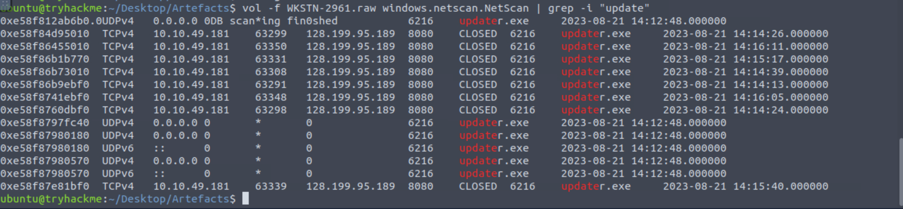
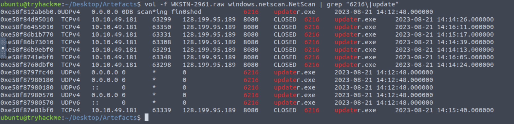
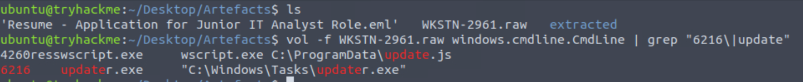
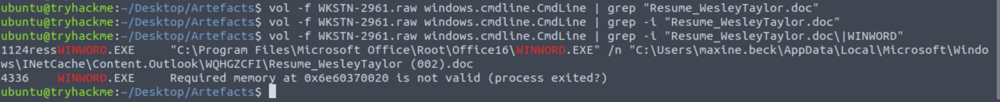

## Boogeyman 2 — Short Investigation Note

### Scenario

Maxine Beck from HR received a phishing email with a malicious resume attachment. The attacker used a Word macro to download and execute Stage 2 malware, then established C2 communication and created persistence using a scheduled task.

---

## 1. Phishing Email Analysis

### Sender email

Answer:

```text
westaylor23@outlook.com
```

How to find:

```bash
grep -i "^From:" "Resume - Application for Junior IT Analyst Role.eml"
```

### Victim email

Answer:

```text
maxine.beck@quicklogisticsorg.onmicrosoft.com
```

How to find:

```bash
grep -i "^To:" "Resume - Application for Junior IT Analyst Role.eml"
```

### Malicious attachment

Answer:

```text
Resume_WesleyTaylor.doc
```

How to find:

```bash
grep -iE "filename=|Content-Disposition|Content-Type" "Resume - Application for Junior IT Analyst Role.eml"
```

---

## 2. Attachment Extraction and Hashing

The `.doc` attachment was inside the `.eml` file, encoded as a MIME attachment. I extracted it with Python, then calculated the MD5.

Extract attachment:

```bash
python3 - <<'PY'
from email import policy
from email.parser import BytesParser
from pathlib import Path

eml = Path("Resume - Application for Junior IT Analyst Role.eml")
out = Path("extracted")
out.mkdir(exist_ok=True)

msg = BytesParser(policy=policy.default).parsebytes(eml.read_bytes())

for part in msg.walk():
    filename = part.get_filename()
    if filename:
        data = part.get_payload(decode=True)
        path = out / filename
        path.write_bytes(data)
        print(f"Extracted: {path}")
PY
```

Get MD5:

```bash
md5sum extracted/Resume_WesleyTaylor.doc
```

Answer:

```text
52c4384a0b9e248b95804352ebec6c5b
```

Why: Hashing confirms the exact malicious file and helps with IOC matching.

---

## 3. Macro Analysis with `olevba`

Run:

```bash
olevba Resume_WesleyTaylor.doc
```

The macro used `AutoOpen()`, meaning it runs when the Word document is opened.

Stage 2 download URL:

```text
https://files.boogeymanisback.lol/aa2a9c53cbb80416d3b47d85538d9971/update.png
```

The macro saved it as:

```text
C:\ProgramData\update.js
```

Then executed it with:

```text
wscript.exe C:\ProgramData\update.js
```

Answers:

```text
Stage 2 process: wscript.exe
Stage 2 payload path: C:\ProgramData\update.js
```

Why attacker used it: `wscript.exe` is a legitimate Windows script interpreter, commonly abused to run malicious `.js` payloads.

---

## 4. Memory Analysis with Volatility

### Find PID of Stage 2 process

Command:

```bash
vol -f WKSTN-2961.raw windows.cmdline.CmdLine | grep -i "update.js\|wscript"
```

Answer:

```text
4260
```

Why: The command line showed `wscript.exe C:\ProgramData\update.js`.

### Find parent PID

Command:

```bash
vol -f WKSTN-2961.raw windows.pslist.PsList | grep -i wscript
```

Output showed:

```text
PID: 4260
PPID: 1124
```

Answer:

```text
1124
```

Why: PPID shows which process launched `wscript.exe`, likely Word.

---

## 5. Stage 2 Downloads Malicious Binary

To find the malicious binary URL, I searched memory strings:

```bash
strings WKSTN-2961.raw | grep -Ei "http.*\.exe|https.*\.exe"
```

Answer:

```text
https://files.boogeymanisback.lol/aa2a9c53cbb80416d3b47d85538d9971/update.exe
```

Why: `update.js` downloaded the next-stage executable.

Attack chain:

```text
Word macro
→ downloads update.js
→ wscript.exe executes update.js
→ update.js downloads update.exe
```

---

## 6. C2 Process and Network Connection

Find C2 process:

```bash
vol -f WKSTN-2961.raw windows.netscan.NetScan | grep -i "update"
```

Answer:
```text
PID: 6216
Process: updater.exe
C2: 128.199.95.189:8080
```

Full malicious process path:

```text
C:\Windows\Tasks\updater.exe
```

How to find full path:

```bash
vol -f WKSTN-2961.raw windows.cmdline.CmdLine | grep -i "6216\|updater"
```

Why attacker used it: `updater.exe` was the malware used to establish C2 communication with the attacker server.

---

## 7. Malicious Email Attachment Path in Memory


Command:

```bash
vol -f WKSTN-2961.raw windows.cmdline.CmdLine | grep -i "Resume_WesleyTaylor.doc\|WINWORD"
```

Answer:

```text
C:\Users\maxine.beck\AppData\Local\Microsoft\Windows\INetCache\Content.Outlook\WQHGZCFI\Resume_WesleyTaylor (002).doc
```

Why search `WINWORD`: `.doc` files are opened by Microsoft Word, whose process name is `WINWORD.EXE`.

Useful logic:

```text
.doc/.docx  → WINWORD.EXE
.xls/.xlsx  → EXCEL.EXE
.js         → wscript.exe / cscript.exe
.exe        → process name itself
```

---

## 8. Persistence with Scheduled Task

Search memory for scheduled task commands:

```bash
strings WKSTN-2961.raw | grep -i "schtasks"
```

Answer:

```cmd
schtasks /Create /F /SC DAILY /ST 09:00 /TN Updater /TR 'C:\Windows\System32\WindowsPowerShell\v1.0\powershell.exe -NonI -W hidden -c \"IEX ([Text.Encoding]::UNICODE.GetString([Convert]::FromBase64String((gp HKCU:\Software\Microsoft\Windows\CurrentVersion debug).debug)))\"'
```

What it does:

```text
/Create       creates a scheduled task
/F            forces overwrite
/SC DAILY     runs daily
/ST 09:00     runs at 09:00
/TN Updater   task name is Updater
/TR           command to run
```

Why attacker used it: persistence. Every day at 09:00, the task runs hidden PowerShell, reads an encoded payload from the registry, decodes it, and executes it.

---

## Full Attack Flow

```text
Phishing email received by Maxine
→ malicious Resume_WesleyTaylor.doc opened
→ AutoOpen macro runs
→ macro downloads update.png
→ saves it as C:\ProgramData\update.js
→ executes update.js with wscript.exe
→ update.js downloads update.exe
→ malware runs as updater.exe
→ updater.exe connects to 128.199.95.189:8080
→ attacker creates scheduled task for persistence
→ scheduled task runs hidden PowerShell daily from registry payload
```

## Main Lessons

```text
Email headers identify sender and victim.
MIME attachments must be extracted before hashing.
olevba reveals malicious Office macros.
AutoOpen means macro runs when document opens.
wscript.exe is commonly abused to run .js payloads.
Volatility cmdline finds executed commands and PIDs.
Volatility netscan links processes to C2 connections.
strings can recover URLs and persistence commands from memory.
schtasks is commonly abused for persistence.
```

