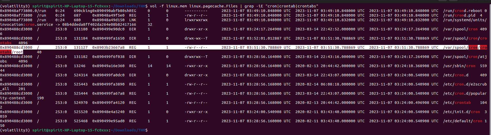

## Profile Challenge note — what we learned

In this Linux memory forensics challenge, the main lesson was: **Volatility3 needs the correct Linux kernel symbols before most Linux plugins work**.

We did **not install a new plugin**. We created a **Volatility Linux symbol file** for this kernel:

```text
Linux 5.4.0-166-generic
```

The process was:

```text
Get kernel banner
→ download matching Ubuntu dbgsym package
→ extract vmlinux
→ generate symbol with dwarf2json
→ place .json.xz in Volatility symbols/linux
→ run Linux plugins successfully
```

For real scenarios, the workflow is:

```text
1. Identify kernel version
2. Fix symbols if plugins fail
3. List processes and command lines
4. Check bash history
5. Check environment variables
6. Check network connections
7. Search page cache for suspicious files
8. Dump/recover files and hash them
9. Check cron/persistence files
```

## Important commands table

| Goal                        | Command                                                                         |
| --------------------------- | ------------------------------------------------------------------------------- |
| Activate Volatility venv    | `source ~/venvs/volatility3/bin/activate`                                       |
| Check Volatility works      | `vol -h`                                                                        |
| Get Linux kernel version    | `vol -f linux.mem banners.Banners`                                              |
| Clear Volatility cache      | `vol --clear-cache -f linux.mem linux.psaux.PsAux`                              |
| List processes + args       | `vol -f linux.mem linux.psaux.PsAux`                                            |
| Save process output         | `vol -f linux.mem linux.psaux.PsAux \| tee psaux.txt`                           |
| Find suspicious commands    | `grep -iE "wget\|gcc\|su \|root\|pass\|ssh" psaux.txt`                          |
| Bash history from memory    | `vol -f linux.mem linux.bash.Bash \| tee bash.txt`                              |
| Search bash history         | `grep -iE "wget\|gcc\|passwd\|cron\|ssh\|root" bash.txt`                        |
| Environment variables       | `vol -f linux.mem linux.envars.Envars \| tee envars.txt`                        |
| Find SSH client IP/ports    | `grep -i "SSH_CLIENT" envars.txt`                                               |
| Network sockets             | `vol -f linux.mem linux.sockstat.Sockstat`                                      |
| Search page-cache files     | `vol -f linux.mem linux.pagecache.Files`                                        |
| Find malicious file path    | `vol -f linux.mem linux.pagecache.Files \| grep -iE "pkexecc\|shell.c"`         |
| Dump file by path           | `vol -f linux.mem -o dumps linux.pagecache.InodePages --find /path/file --dump` |
| Recover cached filesystem   | `vol -f linux.mem -o dumps linux.pagecache.RecoverFs`                           |
| Hash dumped file MD5        | `md5sum file`                                                                   |
| Raw memory string search    | `strings -a linux.mem \| grep -i "keyword"`                                     |
| Search cron files           | `vol -f linux.mem linux.pagecache.Files \| grep -iE "cron\|crontab"`            |
| Read recovered cron content | `cat recovered/path/to/cronfile`                                                |

## Key forensic idea

`bash.Bash`, `psaux.PsAux`, `envars.Envars`, `sockstat.Sockstat`, and `pagecache.*` are very useful together:

```text
bash history = what commands were typed
psaux = what was running
envars = SSH session/client evidence
sockstat = network connections
pagecache = files still recoverable from memory
```

In this challenge, those helped us find:

```text
exposed root password
malicious compiled file
attacker IP/port
cron persistence
malicious cron command
```
--------------------
---
#Profile short 

###What is the exposed root password? Ftrccw45PHyq
i used below command even the second part is not neccesary 
`vol -f linux.mem linux.bash.Bash | tee bash.txt`

###And what time was the users.db file approximately accessed? Format is YYYY-MM-DD HH:MM:SS? 2023-11-07 03:49:45
the asnwer is the same line of above question's answer

###What is the MD5 hash of the malicious file found? 0511ccaad402d6d13ce801e1e9136ba2
You already have a clue from linux.bash.Bash: wget ... shell.c, compiled to pkexecc, then executed. So the likely malicious file is pkexecc; now you need to locate/dump it and hash it.

the run this code:
```
`mkdir -p dumps

vol -f linux.mem -o dumps linux.pagecache.InodePages --find /home/paco/pkexecc --dump | tee inode_pkexecc.txt
md5sum dumps/inode_*.dmp
```

###What is the IP address and port of the malicious actor? Format is IP:Port? 10.0.2.72:1337
from the previous output which was related to download the shell we know the malicious ip and now we have to find the port with below command:
`vol -f linux.mem linux.sockstat.Sockstat | grep "10.0.2.72"`

###What is the full path of the cronjob file and its inode number? Format is filename:inode number? /var/spool/cron/crontabs/root:131127
i used below commands:
`vol -f linux.mem linux.pagecache.Files | grep -iE "cron|crontab|crontabs"`



###What command is found inside the cronjob file? * * * * * cp /opt/.bashrc /root/.bashrc
with this command:
`vol -f linux.mem -o dumps linux.pagecache.InodePages --find /var/spool/cron/crontabs/root --dump` and then `cat dumps/*` Or
`strings -a linux.mem | grep -A3 -B3 "cp /opt/.bashrc"` for faster	
