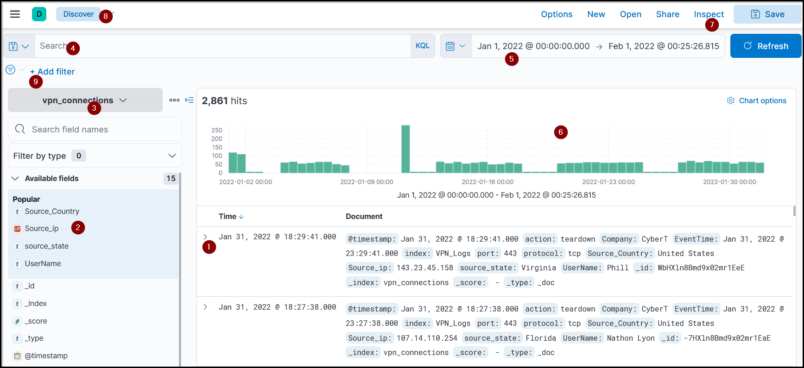

## Elastic Stack / ELK Short Notes

### What is ELK?

* **Elastic Stack (ELK)** is used to store, search, analyze, and visualize large data.
* Originally used for application monitoring and large dataset search.
* Now commonly used by SOC teams like a SIEM.

---

## Main Components

### 1. Elasticsearch

* Search and analytics engine.
* Stores JSON-formatted documents.
* Used to search, analyze, and correlate data.
* Supports REST API.

### 2. Logstash

* Data processing engine.
* Collects logs from different sources.
* Filters, parses, and normalizes data.
* Sends data to Elasticsearch, Kibana, ports, or files.

Logstash config has 3 parts:

* **Input:** where data comes from.
* **Filter:** how data is parsed/normalized.
* **Output:** where data is sent.

### 3. Beats

* Lightweight host-based agents.
* Send endpoint data to Elasticsearch or Logstash.
* Examples:

  * **Winlogbeat:** Windows event logs.
  * **Packetbeat:** network traffic flows.

### 4. Kibana

* Web interface for visualization.
* Works with Elasticsearch.
* Used for dashboards, charts, timelines, and investigations.

---

## How ELK Works Together

1. **Beats** collect data from endpoints.
2. **Logstash** parses and normalizes the data.
3. **Elasticsearch** stores and indexes the data.
4. **Kibana** visualizes and investigates the data.
---
## Kibana Discover Tab Short Notes

### Purpose

* **Discover** is the main Kibana workspace for SOC analysts.
* Used to search logs, investigate anomalies, apply filters, and analyze raw events.

---

## Main Discover Features

### Logs

* Each row represents one event/log.
* Shows event data with fields and values.

### Fields Pane

* Left panel showing parsed/normalized fields.
* Clicking a field shows top values and percentages.
* `+` includes a value.
* `-` excludes a value.

### Index Pattern

* Defines which Elasticsearch data Kibana searches.
* Different log sources have different index patterns.
* Example lab index pattern:

```text
vpn_connections
```

### Search Bar

* Used to write queries and narrow results.

### Time Filter

* Filters logs by time range.
* For this lab, include **January 2022**.
* A wide range like **Last 15 years** also works.

### Time Interval / Timeline

* Shows event count over time.
* Useful for spotting spikes or unusual activity.
* Example: spike on **11 January 2022**.

### Top Bar

* Used to save, open, share, or manage searches.

### Add Filter

* Lets analysts filter specific fields without writing full queries.

---

## Create Table

* Logs are raw by default.
* Select important fields to create a cleaner table.
* Reduces noise and improves readability.
* Table format can be saved for future use.
---
## KQL Search Short Notes

### What is KQL?

* **KQL = Kibana Query Language**
* Used in Kibana Search Bar to search Elasticsearch logs.

---

## Two Search Types

### 1. Free Text Search

Searches text anywhere in the logs, regardless of field.

```kql
"United States"
```

* Finds logs containing the full phrase.
* Searching only `United` may return nothing because KQL searches whole terms.

### Wildcard Search

```kql
United*
```

* Matches words starting with `United`.
* Example: `United States`, `United Nations`.

---

## Logical Operators

### AND

Returns logs containing both terms:

```kql
"United States" AND "Virginia"
```

### OR

Returns logs containing either term:

```kql
"United States" OR "England"
```

### NOT

Excludes a term:

```kql
"United States" AND NOT ("Florida")
```

---

## 2. Field-Based Search

Searches specific fields using:

```kql
FieldName : Value
```

Example:

```kql
Source_ip : 238.163.231.224 AND UserName : Suleman
```

Meaning:

* Show logs where `Source_ip` is `238.163.231.224`
* And `UserName` is `Suleman`

---

## Key Point

* Kibana suggests available fields when clicking the search bar.
---
## Kibana Visualization Short Notes

### Visualization Tab

* Used to create visual views of data.
* Supports:

  * tables
  * pie charts
  * bar charts
  * other dashboards

---

### Create Visualization

* Can start from the **Discover** tab by clicking a field and selecting visualization.
* Choose visualization type based on the data.

---

### Correlation

* Used to compare multiple fields.
* Example:

  * `Source_IP`
  * `Source_Country`

This can show which IPs are linked to which countries.

---

### Save Visualization

Steps:

1. Create the visualization.
2. Click **Save**.
3. Add title and description.
4. Click **Save and add to library**.

---

### Failed VPN Attempts Visualization

Use:

* Data view: `vpn_connections`
* Time range: include **January 2022**
* Filter:

```kql
action: failed
```

Table fields:

* `UserName`
* `Source_ip`

Purpose:

* Show users and IP addresses involved in failed VPN connection attempts.
---
## Kibana Dashboards Short Notes

### Purpose

* Dashboards give visibility into collected logs.
* Used to combine saved searches and visualizations in one view.
* Useful for monitoring specific areas like VPN activity.

---

## Creating a Custom Dashboard

Steps:

1. Go to **Dashboard** tab.
2. Click **Create dashboard**.
3. Click **Add from Library**.
4. Select saved searches and visualizations.
5. Add them to the dashboard.
6. Arrange/resize items as needed.
7. Save the dashboard.

---

### Key Point

* Dashboards help SOC analysts monitor important data quickly using multiple visual panels in one place.

