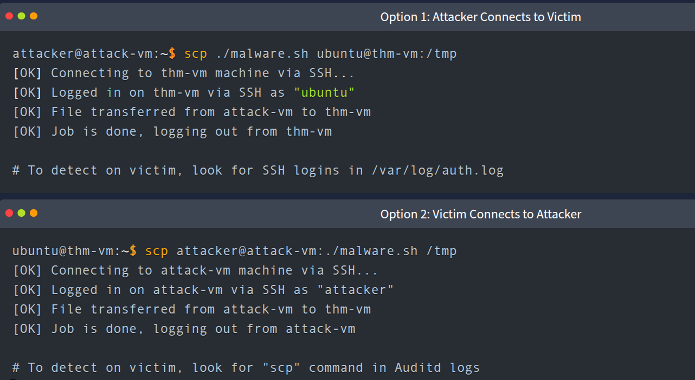

### Linux Discovery (short note)

After gaining access to a Linux system, attackers typically start with **discovery commands** to understand the environment. Most intrusions begin with automated access (botnets), followed by human-controlled exploration.

Common discovery steps:

* **System info:** `pwd`, `ls /`, `uname -a`, `hostname`
* **Users:** `id`, `whoami`, `w`, `/etc/passwd`
* **Processes & network:** `ps aux`, `ip a`, `ss -tnlp`
* **Virtualization/sandbox checks:** `systemd-detect-virt`

Attackers often begin with `whoami` to confirm access level, making it a strong detection signal in security monitoring.
---

### Specialized Discovery (short note)

After initial system reconnaissance, attackers perform **targeted discovery** based on their objective:

* **Credential theft:** `history | grep pass`, `find / -name .env`, `find /home -name id_rsa`
* **Crypto mining assessment:** `lscpu`, `cat /proc/cpuinfo`, `free -m`, `top`, `htop`
* **Network scanning:** `ping`, looped IP scans with `nc`

---

### Detecting Discovery

Discovery activity can be detected using tools like **auditd** and SIEM platforms by monitoring command execution (e.g., via `ausearch`).

Key challenge: **context analysis**
The same commands can be:

* malicious (web server running `whoami`, `find`, `grep`)
* legitimate (admin or monitoring tools using `ping`, `top`)

To investigate properly, analysts build **process trees** using audit logs:

* Identify the command (`whoami`)
* Trace parent process (`ppid`)
* Expand to related processes (`--ppid`) to detect scripts or automation (e.g., `/tmp/lp.sh`)

This helps distinguish normal admin behavior from malicious execution chains.
---

-------
### Hack and Forget Attacks (short note)

After initial access, attackers often switch to **high-volume opportunistic attacks** aimed at quick profit rather than long-term persistence.

Common goals:

* **Cryptomining:** exploit CPU/GPU resources for profit
* **Botnet enrollment:** add host to networks like Mirai for DDoS and automation
* **Proxy usage:** route phishing traffic or hide attacker activity

---

### Ingress Tool Transfer

Attackers need to download or transfer malware using common built-in tools:

* `wget` → download files from URLs into the system
* `curl` → fetch remote payloads or scripts
* `scp` → transfer files over SSH between machines

Detection typically involves:

* **auditd logs** for `wget`, `curl`, `scp`
* **SSH authentication logs** in `/var/log/auth.log` (especially for inbound access)
* **process creation monitoring**

When logs are missing (e.g., attacker pushes files via SSH into the victim), focus shifts to:

* Network traffic to suspicious domains/IPs
* New files in `/tmp`, `/var/tmp`, or suspicious filenames (e.g., `shell.php`)
* EDR/antivirus detections

Overall, these attacks are noisy but fast, making them easier to detect through command execution and network artifacts.
---
-----
### Dota 3 Malware Analysis (short note)

Dota3 is a **SSH brute-force-based botnet malware** that spreads globally by exploiting weak credentials and then deploying a cryptominer infection chain.

---

### Initial Access

* Large botnet scans the internet for open SSH services
* Performs brute-force attacks (often targeting `root`)
* Uses common weak passwords (top 1000 list)
* Successful login leads to attacker-controlled SSH session

---

### Discovery Phase

After login, the attacker quickly gathers system info to assess mining capability:

* CPU: `cat /proc/cpuinfo`, `lscpu`
* RAM: `free -m`
* System info: `uname -m`
* Environment/context: `w`, `crontab -l`
* Misc checks: `ls -lh $(which ls)`

High focus on **hardware profiling → indicates cryptomining objective**

---

### Persistence

Attackers then lock out the victim and ensure long-term access:

* Change password to block other botnets/admins
* Replace SSH keys with attacker-controlled key
* Recreate `~/.ssh/authorized_keys` with malicious key
* Remove existing `.ssh` directory contents
* Often leaves identifiable marker strings (e.g. `mdrfckr`)

---

### Detection Strategy

SOC detection relies on:

* **Auth logs:** successful SSH logins from suspicious IPs
  (`/var/log/auth.log`, “Accepted password” entries)
* **Auditd logs:** execution of discovery commands (`uname`, `lscpu`, etc.)
* **Indicators of compromise:** strings like `mdrfckr`
* **Behavioral signals:** sudden CPU profiling + SSH login spike

---
auditd logs can be viewed as `ausearch -i -if /home/ubuntu/scenario/audit.log`
### Core idea

Dota3 is not stealthy — it survives mainly due to **weak SSH credentials**, and its lifecycle is clearly visible through login + discovery + persistence patterns.
---

------------
### Cryptominer Setup (short note)

After gaining persistence, Dota3 deploys its malware payload.

---

### Malware Deployment

* Transfers malware archive via **SCP** (e.g. `dota3.tar.gz`)
* Stores files in **hidden `/tmp` directories** to blend in:

  * `/tmp/.X26-unix`
  * `/tmp/.X26-unix/.rsync/c`
* Extracts archive using `tar`

---

### Execution

Two main binaries are launched using `nohup` (survive logout):

* **`tsm`** → scans internal networks (`192.168.*`, `172.16.*`) for more SSH targets
* **`initall`** → runs **XMRig cryptominer** to consume CPU and generate revenue

`nohup` keeps malware running in the background after SSH disconnect.

---

### Detection Indicators

* **auditd:** hidden directory creation in `/tmp`
* **auditd:** suspicious archives (`dota3.tar.gz`)
* **auditd:** execution of `nohup`
* **Network logs:** broad SSH scanning activity
* **EDR/AV:** detection of XMRig miner behavior

we can find the tar and archive files that fucking attacker download with below command:
`ausearch -i -if audit.log | grep proctitle=tar`
---

### Attack flow

SSH access → SCP upload → hidden staging → network scanning → cryptomining → persistent background execution.

