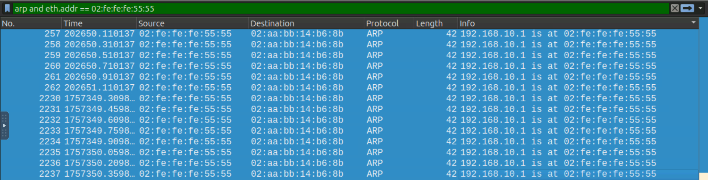
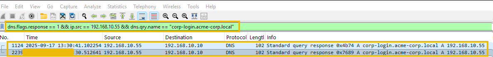

### MITM (Man-in-the-Middle) Attack – Key Points

* Attacker secretly intercepts communication between two parties.
* Goal: steal data, modify traffic, or inject malicious content.

### How It Works

1. **Interception** – attacker inserts themselves into the communication path.
2. **Manipulation** – attacker reads, alters, or injects data.

### Common Techniques

* Packet Sniffing
* Session Hijacking
* SSL Stripping
* DNS Spoofing
* IP Spoofing
* Rogue Wi-Fi Access Points

### Cyber Kill Chain

* **Exploitation:** Intercepts trusted communications.
* **Installation:** Injects malware or malicious payloads.

### Impact

* Credential theft
* Data breaches
* Traffic manipulation
* Malware delivery

### SOC Relevance

* Indicates an active intrusion in progress.
* Early detection can prevent data theft and further compromise.
---
### ARP Spoofing (MITM) – Key Points

* ARP maps **IP addresses → MAC addresses** on a local network.
* ARP has **no authentication**, making it vulnerable to spoofing.

### ARP Spoofing Attack

* Attacker sends fake **ARP replies**.
* Victim associates the attacker's MAC with the gateway's IP.
* Traffic is redirected through the attacker (MITM).

### Indicators of Attack

* Duplicate IP-to-MAC mappings
* Unsolicited (gratuitous) ARP replies
* High volume of ARP traffic
* Multiple MACs claiming the gateway IP
* Unusual traffic routing through a single MAC

### Wireshark Filters

* All ARP traffic:

```wireshark
arp
```

* ARP Requests:

```wireshark
arp.opcode == 1
```

* ARP Replies:

```wireshark
arp.opcode == 2
```

* Gratuitous ARP:

```wireshark
arp.isgratuitous
```

* Gateway IP advertised by multiple MACs:

```wireshark
arp.opcode == 2 && arp.src.proto_ipv4 == 192.168.10.1
```

* Duplicate mappings:

```wireshark
arp.duplicate-address-detected || arp.duplicate-address-frame
```
How many ARP packets from the gateway MAC Address were observed?
for answering to this question we can use below command:
`arp && arp.src.proto_ipv4 == 192.168.10.1 && eth.src == 02:aa:bb:cc:00:01`
### Goal

* Detect ARP cache poisoning.
* Identify the attacker's MAC spoofing the gateway.
* Confirm MITM positioning between victim and gateway.
---
# 🕵️ Threat Hunting Cheat Sheet: Wireshark & Splunk

## 🦈 Wireshark: ARP Spoofing Detection Filters

**1. Find Gratuitous ARPs (Attacker Setup)**
Isolate devices aggressively announcing their MAC address to the network without being asked.
`arp.isgratuitous == 1`

**2. Isolate Attacker Footprint**
Once you find the suspicious MAC address, filter to see exactly who they are targeting.
`arp and eth.src == [INSERT_ATTACKER_MAC]`
*(Example: `arp and eth.src == 02:fe:fe:fe:55:55`)*

**3. Detect the Collision (The Quickest Win)**
Highlight the exact moment a MAC address falsely claims an IP address already in use.
`arp.duplicate-address-detected`

---

## 🟢 Splunk: SIEM Log Analysis Queries

**1. Find a Scanned Internal Host (Port Scan)**
Find the victim by searching for abnormal port breadth (Distinct Count of destination ports).
```splunk
index=firewall 
| stats dc(dest_port) as unique_ports_hit by dest_ip
| sort - unique_ports_hit
| head 5
```
---

in the below pictures you can see that the fucking attacker with 02:fe:fe:fe:55:55 mac address is lying like a dog 14 time:


---

### DNS Spoofing (MITM) – Key Points

* DNS translates domain names into IP addresses.
* DNS Spoofing (Cache Poisoning) tricks victims into resolving a domain to an attacker's IP.

### Attack Flow

1. Victim requests a domain.
2. Attacker intercepts the DNS query.
3. Attacker sends a forged DNS response.
4. Victim is redirected to a malicious server.
5. Credentials and sensitive data can be stolen.

### Indicators of Attack

* Multiple DNS responses for the same query
* DNS replies from unexpected IPs
* Very low TTL values
* Unsolicited DNS responses

### Wireshark Filters

* All DNS traffic:

```wireshark
dns
```
* DNS request:
`dns.flags.response == 0`

* DNS responses:

```wireshark
dns.flags.response == 1
```

* Responses from legitimate DNS server:

```wireshark
dns.flags.response == 1 && ip.src == 8.8.8.8
```

* Responses from suspicious sources:

```wireshark
dns.flags.response == 1 && ip.src != 8.8.8.8
```

* Specific domain investigation:

```wireshark
dns && dns.qry.name == "corp-login.acme-corp.local"
```

### Goal

* Detect forged DNS replies.
* Identify rogue DNS servers.
* Confirm victim redirection as part of a MITM attack.

---

### SSL Stripping (MITM) – Key Points

* SSL Stripping downgrades **HTTPS → HTTP**, allowing attackers to intercept plaintext traffic.
* The attacker maintains an HTTPS session with the server while the victim communicates over HTTP.

### Attack Flow

1. ARP Spoofing → Gain MITM position.
2. DNS Spoofing → Redirect victim to attacker.
3. SSL Stripping → Replace HTTPS with HTTP.
4. Capture credentials and sensitive data in plaintext.

### Indicators

* HTTPS traffic suddenly switches to HTTP.
* Missing TLS handshakes for a domain that normally uses HTTPS.
* HTTP redirects (`301`, `302`) to insecure resources.
* Credentials visible in cleartext HTTP POST requests.

### Wireshark Filters

* TLS/SSL traffic:

```wireshark
tls || ssl
```

* TLS handshakes for a domain:

```wireshark
tls.handshake.type == 1 && tls.handshake.extensions_server_name == "corp-login.acme-corp.local"
```

* Spoofed DNS responses:

```wireshark
dns.flags.response == 1 && ip.src == 192.168.10.55
```

* HTTP traffic between victim and attacker:

```wireshark
http && ip.src == 192.168.10.10 && ip.dst == 192.168.10.55
```

### Attack Timeline

1. ARP Spoofing → Gateway poisoning
2. DNS Spoofing → Victim redirected to attacker
3. SSL Stripping → HTTPS downgraded to HTTP
4. Credential Theft → Login data captured in plaintext

### Goal

* Detect HTTPS downgrades.
* Verify missing TLS traffic.
* Identify exposed credentials and successful MITM attacks.
---
Our hypothesis about SSL stripping is that it is done after the attacker has successfully performed DNS spoofing, sending the victim to the attacker's IP. In the previous task, we identified the attacker's IP address performing the DNS spoofing. Let's isolate DNS responses from the attacker to show the victim was pointed to the attacker's IP, as shown below:

The above result shows two incidents in which the attacker's IP sent spoofed DNS responses for the domain of interest. 
