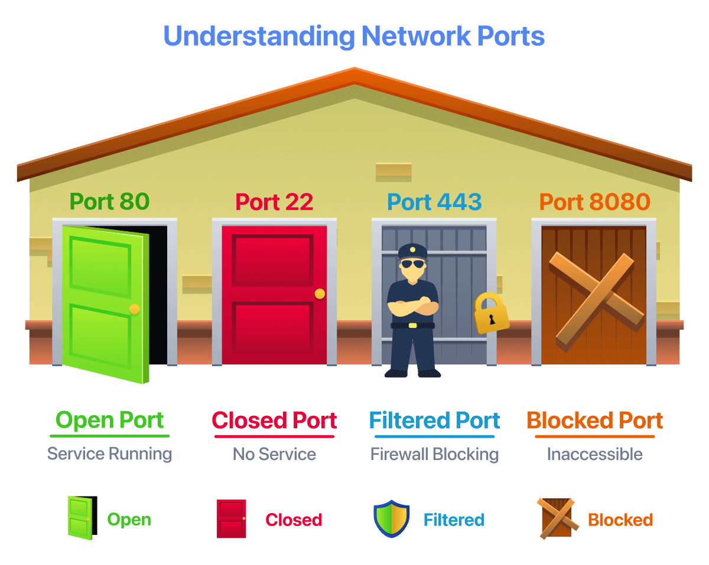
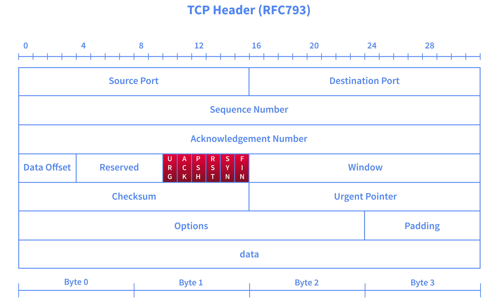

### Ports & Nmap States — Short Note

* **Port:** Identifies a network service on a host.
* Common ports:

  * **TCP 80** → HTTP
  * **TCP 443** → HTTPS
  * **TCP 22** → SSH
  * **UDP 53** → DNS
* **Open:** Service is listening.
* **Closed:** No service is listening, but reachable.
* **Filtered:** Firewall/security device blocks access.
* **Unfiltered:** Reachable, but Nmap can't determine open/closed.
* **Open|Filtered:** Nmap can't distinguish.
* **Closed|Filtered:** Nmap can't distinguish.

**Nmap considers 6 port states.**

🎯 **Most interesting for a pentester:** **Open** — it means a service is accessible and can be investigated.
---
### TCP Flags — Short Note

TCP has **6 important flags**:

* **URG** → urgent data
* **ACK** → acknowledges data
* **PSH** → push data to application
* **RST** → reset/terminate connection
* **SYN** → start TCP connection
* **FIN** → finish connection

**Answers:**

* Reset flag → **RST**
* First TCP handshake flag → **SYN**
---
### TCP Connect Scan — Short Note

* `-sT` → performs a **TCP 3-way handshake** to check open ports.
* **Open:** SYN → SYN/ACK → ACK → then connection is closed with RST/ACK.
* **Closed:** Target responds with RST/ACK.
* Unprivileged users → **`-sT` is the available TCP scan**.
* Default → scans **1000 common ports**.
* `-F` → fast scan, **100 ports**.
* `-r` → scan ports in sequential order.

### Answers

* **FTP (port 21):** **open** *(the `open` is masking the answer in your copied text)*
* **Port 53:** **domain/DNS** Domain

---
