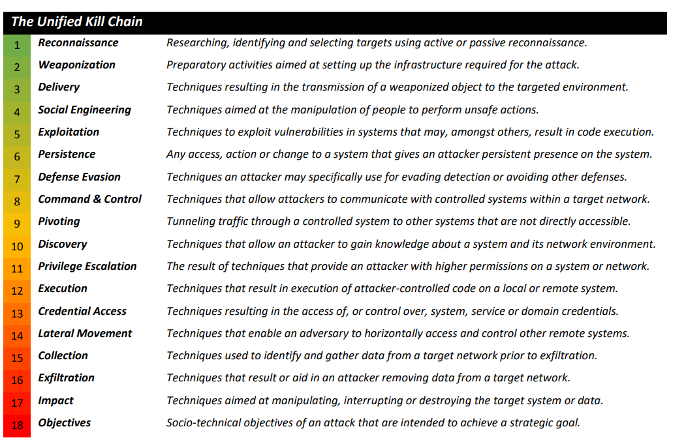

## Detection Engineering — Short Note

**Detection engineering** is the continuous process of creating, testing, and improving security detections to identify malicious activity, misconfigurations, or risky behavior in an environment.

It helps security teams move from reactive alerting to a more structured and threat-focused defense system.

## Main Detection Types

| Detection Type                 | Meaning                                                                  | Example                                                 |
| ------------------------------ | ------------------------------------------------------------------------ | ------------------------------------------------------- |
| **Configuration Detection**    | Finds misconfigurations or changes from expected infrastructure settings | Unexpected admin user, open port, weak IAM policy       |
| **Modelling**                  | Builds a normal baseline and detects deviations                          | User logs in at unusual time or downloads too much data |
| **Indicator Detection**        | Uses known IOCs like IPs, hashes, domains, filenames                     | Detect known malware hash or malicious IP               |
| **Threat Behaviour Detection** | Detects attacker TTPs, not just fixed IOCs                               | PowerShell abuse, lateral movement, credential dumping  |

## Key Points

* **Configuration detection** is easy in static environments but hard in dynamic ones.
* **Modelling** helps detect unknown threats but needs a good baseline.
* **Indicator detection** is fast to deploy but weak if attackers change IPs, hashes, or domains.
* **Threat behaviour detection** is stronger because it focuses on attacker behavior, but it needs more data and good tuning.

## Detection as Code

**Detection as Code** means writing detection rules like software code.

Benefits:

| Benefit                | Meaning                                |
| ---------------------- | -------------------------------------- |
| **Version Control**    | Track changes to detection rules       |
| **Automation**         | Test and deploy detections faster      |
| **Reusable Code**      | Reuse detection logic across rules     |
| **Team Collaboration** | Analysts and engineers work together   |
| **Better Testing**     | Reduce false positives and blind spots |

## Questions

| Question                                                      | Answer               |
| ------------------------------------------------------------- | -------------------- |
| Which detection type focuses on infrastructure misalignments? | **Configuration**    |
| Which detection approach builds asset/activity baselines?     | **Modelling**        |
| Which detection type integrates with defensive playbooks?     | **Threat Behaviour** |
---
Here’s the short note:

## Detection Gap Analysis — Short Note

**Detection Gap Analysis** means checking where an organization is weak in detecting threats and improving those areas.

## Main Steps

| Step                             | Meaning                                                                     |
| -------------------------------- | --------------------------------------------------------------------------- |
| **1. Detection Gap Analysis**    | Find missing or weak detections in the environment                          |
| **Reactive Analysis**            | Learn from previous incidents and identify what was missed                  |
| **Proactive Analysis**           | Use MITRE ATT&CK and threat intelligence to predict possible attacks        |
| **2. Datasource Identification** | Find which logs/data sources are needed for detection                       |
| **3. Baseline Creation**         | Define what “normal behavior” looks like                                    |
| **4. Log Collection**            | Collect useful logs from hosts, network, applications, etc.                 |
| **5. Rule Writing**              | Create detection rules for suspicious patterns                              |
| **6. Deployment & Tuning**       | Deploy rules, monitor alerts, reduce false positives, and improve over time |

## Baseline Types

| Baseline Type           | Meaning                                                  |
| ----------------------- | -------------------------------------------------------- |
| **High-level baseline** | General security standards based on policy               |
| **Technical baseline**  | OS/service-specific configuration and behavior standards |

## Rule Examples

| Data Type              | Rule Type       |
| ---------------------- | --------------- |
| Network traffic        | **Snort rules** |
| File/malware detection | **YARA rules**  |
| Log detection          | **Sigma rules** |

## Key Idea

Detection engineering is not a one-time task. It is a continuous cycle:

```text
Identify gaps → collect logs → build baseline → write rules → deploy → tune → improve
```
---

## Security Frameworks — Short Note

These frameworks help analysts understand attacker behavior and build better detections.

| Framework              | Purpose                                                                                                          |
| ---------------------- | ---------------------------------------------------------------------------------------------------------------- |
| **MITRE ATT&CK**       | Maps attacker tactics, techniques, and procedures across platforms like Windows, Linux, macOS, cloud, and mobile |
| **MITRE CAR**          | Provides analytics to detect attacker behaviors based on ATT&CK                                                  |
| **Pyramid of Pain**    | Shows which detections hurt attackers the most                                                                   |
| **Cyber Kill Chain**   | Describes the main phases of a cyberattack                                                                       |
| **Unified Kill Chain** | Expanded version of the Cyber Kill Chain with more attack phases                                                 |

## MITRE ATT&CK

Used for:

```text
Detection gap analysis
Threat modelling
Mapping attacker TTPs
Writing better detection rules
```

Example:

```text
Tactic: Privilege Escalation
Technique: Abuse Elevation Control Mechanism
```

## Pyramid of Pain

The harder something is for attackers to change, the stronger the detection.

| Easy for attacker to change | Hard for attacker to change |
| --------------------------- | --------------------------- |
| Hashes                      | TTPs                        |
| IP addresses                | Tools                       |
| Domains                     | Behaviors                   |

Best detections focus on **attacker behavior/TTPs**, not only simple IOCs.

## Cyber Kill Chain

The 7 phases:

```text
1. Reconnaissance
2. Weaponisation
3. Delivery
4. Exploitation
5. Installation
6. Command & Control
7. Actions on Objectives
```

## Key Idea

Use frameworks like **ATT&CK**, **CAR**, and **Kill Chain** to understand how attackers operate, then map those behaviors into detection rules and monitoring plans.
---
## ADS Framework — Short Note

**Alerting and Detection Strategy (ADS)** is a framework by Palantir for documenting and building high-quality detections.
Its goal is to reduce **alert fatigue** and make alerts useful for investigation and response.

## ADS Main Sections

| Section                       | Meaning                                            |
| ----------------------------- | -------------------------------------------------- |
| **Goal**                      | Why the alert exists and what behavior it detects  |
| **Categorisation**            | Map detection to MITRE ATT&CK / Kill Chain         |
| **Strategy Abstract**         | High-level explanation of the detection logic      |
| **Technical Context**         | Technical details, platforms, logs, and tools used |
| **Blind Spots & Assumptions** | Where the detection may fail or be bypassed        |
| **False Positives**           | Benign activities that may trigger the alert       |
| **Validation**                | How to test and prove the detection works          |
| **Priority**                  | Alert severity and importance criteria             |
| **Response**                  | Triage and investigation steps for analysts        |

## Detection Maturity Level — DML

**DML** measures how mature an organization is at using threat intelligence for detection and response.

| Level     | Focus                              |
| --------- | ---------------------------------- |
| **DML-0** | No detection                       |
| **DML-1** | Atomic indicators like IPs/domains |
| **DML-2** | Host/network artifacts             |
| **DML-3** | Tools                              |
| **DML-4** | Procedures                         |
| **DML-5** | Techniques                         |
| **DML-6** | Tactics                            |
| **DML-7** | Strategy                           |
| **DML-8** | Adversary goals                    |

## Key Idea

Lower DML levels detect simple indicators like IPs and hashes.
Higher DML levels detect attacker behavior, tactics, strategy, and goals.

Better detection maturity means:

```text
Less IOC-only detection
More behavior-based detection
Better response and investigation context
```
---
## ADS Framework Scenario — Short Note

Scenario goal: build a detection strategy for **changes to privileged/admin groups and accounts in Active Directory**.

Use the **ADS Framework** to document the detection before production.

## ADS Template Meaning

| ADS Stage                     | What to Write                                    |
| ----------------------------- | ------------------------------------------------ |
| **Goal**                      | What behavior you want to detect                 |
| **Categorisation**            | Map to MITRE ATT&CK tactic/technique             |
| **Strategy Abstract**         | High-level detection logic                       |
| **Technical Context**         | Explain the technology, logs, and attacker abuse |
| **Blind Spots & Assumptions** | What must work for detection to succeed          |
| **False Positives**           | Legitimate reasons the alert may trigger         |
| **Priority**                  | Alert severity                                   |
| **Validation**                | How to test the rule                             |
| **Response**                  | What analysts should do after alert fires        |

## Example from Template

The example detection is:

```text
Detect PowerShell loaded into an unusual host process
```

Main idea:

```text
Monitor module loads
Check which process loads PowerShell DLL
Alert if the host process is unusual
```

## For Active Directory Admin Group Changes

You would focus on:

```text
Privileged group membership changes
Admin account creation
Account privilege escalation
Unexpected changes to Domain Admins / Enterprise Admins / Administrators
```

Useful Windows Security Event IDs:

| Event ID               | Meaning                                |
| ---------------------- | -------------------------------------- |
| **4720**               | User account created                   |
| **4728**               | User added to global security group    |
| **4732**               | User added to local security group     |
| **4756**               | User added to universal security group |
| **4729 / 4733 / 4757** | User removed from groups               |
| **4738**               | User account changed                   |

## Key Idea

A good ADS detection is not only the rule. It must include:

```text
Goal → ATT&CK mapping → detection logic → assumptions → false positives → testing → response steps
```
