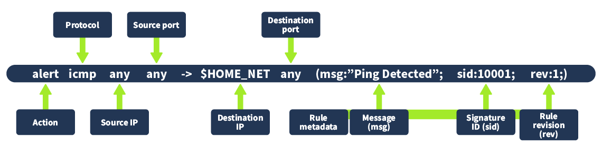

### Intrusion Detection System (IDS)

* IDS monitors network/system activity and alerts on suspicious behavior.
* Unlike a firewall, IDS **detects** attacks but does **not block** them.

### Types of IDS

#### By Deployment

* **HIDS (Host IDS):** Monitors a single host.
* **NIDS (Network IDS):** Monitors traffic across the entire network.

#### By Detection Method

* **Signature-Based:** Detects known attacks using predefined signatures.
* **Anomaly-Based:** Detects deviations from normal behavior; can identify zero-day attacks.
* **Hybrid IDS:** Combines signature and anomaly detection.

### Key Points

* Detects threats that bypass firewalls.
* Generates alerts for security analysts.
* Signature-based IDS is fast for known threats.
* Anomaly-based IDS helps detect unknown and zero-day attacks.
* **Snort** is a popular open-source signature-based IDS.
---
### Snort IDS

* **Snort** is a popular open-source IDS that uses **signature-based** and **anomaly-based** detection.
* Includes built-in rules for known threats and supports **custom rules** for specific traffic.
* Rules can be enabled, disabled, or customized as needed.

### Snort Modes

| Mode               | Purpose                                                           |
| ------------------ | ----------------------------------------------------------------- |
| **Packet Sniffer** | View network traffic without analysis.                            |
| **Packet Logging** | Capture and save traffic as PCAP files for later investigation.   |
| **NIDS Mode**      | Analyze traffic in real-time and generate alerts on rule matches. |

### Key Points

* Built-in and custom detection rules.
* Real-time threat detection in **NIDS mode**.
* Useful for monitoring, logging, and forensic analysis.
* One of the most widely used IDS solutions.
---
**Snort Quick Notes**

During installation, set your network interface and range. Normal mode only captures host traffic; promiscuous mode is needed for full-network monitoring.

Snort config and rules are stored in `/etc/snort` (or another install path). Main config is `snort.lua`, and rules are in the `rules/` folder.

A rule has: action, protocol, source/destination IP & port, and metadata (`msg`, `sid`, `rev`). Example ICMP rule triggers an alert on ping traffic.

Add custom rules in `rules/local.rules`, e.g.:
`alert icmp any any -> 127.0.0.1 any (msg:"Loopback Ping Detected"; sid:10003; rev:1;)`

Run Snort:
`sudo snort -q -l /var/log/snort -i lo -A alert_fast -c /etc/snort/snort.lua`
Here’s what each part does:

```bash
snort
```

Runs the Snort intrusion detection system.

```bash
-q
```

Quiet mode — reduces console output (only important alerts are shown).

```bash
-l /var/log/snort
```

Log directory — where Snort stores output (alerts, logs, events).

```bash
-r Intro_to_IDS.pcap
```

Read mode — tells Snort to analyze a saved packet capture file instead of live traffic.

```bash
-A alert_fast
```

Alert output mode — uses a simple, fast alert format (basic one-line alerts).

```bash
-c /etc/snort/snort.lua
```

Configuration file — tells Snort which rules, networks, and settings to use.

**In short:**
Snort runs in quiet mode, reads a PCAP file, logs results, prints fast alerts, and uses the given configuration.


Test with:
`ping 127.0.0.1`

Analyze PCAP files:
`sudo snort -q -l /var/log/snort -r file.pcap -A alert_fast -c /etc/snort/snort.lua`
---
here you can see the instruction of seeing a rule in snort:

