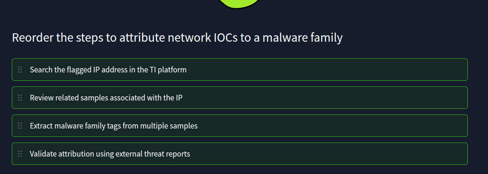
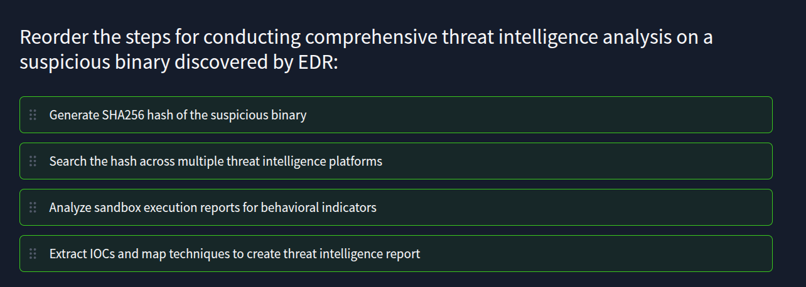

# DNS Domain Analysis & Attack Techniques

## 🔍 Essential DNS Records

* **A / AAAA Records:** Maps domains to IPv4/IPv6 addresses. Used to identify hosting providers or correlate with known threat infrastructure.
* **TXT Records:** Contains mail security (SPF/DKIM) and site verifications.
* *Red Flag:* Empty TXT records or spoofed SPF/DKIM on suspicious domains (highly indicative of phishing).


* **WHOIS / RDAP:** Reveals registrar, registration dates, and domain age.
* *Red Flag:* Domains registered very recently (days or weeks old). Malicious infrastructure is usually rapidly rotated.


## ☠️ Common DNS Attack Vectors

* **CDN Abuse:** Attackers hide true origin servers behind legitimate Content Delivery Networks (e.g., Cloudflare, Fastly). The resolved IP will belong to the CDN, dead-ending IP-based attribution.
* **Typosquatting:** Visually similar domains designed to trick users (e.g., `micros0ft.net`). Always treat brand look-alikes as high risk unless defensively registered by the brand.
* **IDN (Internationalized Domain Name) Attacks:** Substitutes Latin characters with identical-looking Cyrillic or Greek letters (Homograph attacks).
* *Detection Check:* Convert the domain to **Punycode**. If the result starts with `xn--`, it contains hidden non-ASCII characters and is highly suspicious.
---
```markdown
# IP Enrichment & Contextualization

## 🌐 The Goal of IP Enrichment
A raw IP address in an alert is meaningless without context. It could be a hacked home router, a legitimate cloud provider, or a dedicated malware server. Enrichment prevents the SOC from either blocking critical business infrastructure or ignoring a severe threat.

### Core Lookups
* **AbuseIPDB:** Checks if the IP has a history of noisy activity (e.g., port scanning, SSH brute-forcing).
* **VirusTotal:** Provides overall reputation, vendor detections, and community context. 
  * *Rule of Thumb:* If the IP is *not* a shared CDN, even 1 detection warrants caution.

## 🏢 Autonomous Systems (ASN)
An ASN is a registered group of IPs controlled by a single entity. Identifying the ASN (via tools like BGP.Tools) clarifies the IP's likely role:
* **Residential ASNs (e.g., Vodafone):** Alerts here usually mean a user on a VPN or a compromised home router/IoT device.
* **Server Hosting ASNs:** High risk. Attackers frequently rent cheap VPS hosting to run C2 servers and distribute malware.
* **Cloud/CDN ASNs (e.g., AWS, Cloudflare):** Mixed use. Both legitimate enterprise traffic and attacker traffic route through these, requiring further behavioral analysis to determine intent.

## 🌍 Geolocation (GeoIP)
Tools like IPinfo map an IP to a physical region. 
* **Accuracy:** Good for Country-level data; often highly inaccurate at the City level.
* **Use Cases:**
  * **Impossible Travel:** Flagging a login from the US followed by a login from the Netherlands 10 minutes later.
  * **Network Baselines:** Identifying anomalous outbound traffic (e.g., a regional European business suddenly sending gigabytes of data to an unexpected country).

```
---
# Exposed Services & Reconnaissance

## 🎯 Why Analyze Exposed Services?

* **Victim IPs:** Identifies the likely initial access vector (e.g., an exposed SSH or RDP port).
* **Attacker IPs:** If an attacker's IP exposes outdated services or RDP, it is likely a compromised legitimate host being used as a jump box or proxy.

## 🔎 Service Recon Tools

* **Shodan:** Indexes internet-facing devices. Used to identify open ports, running services, and service banners (revealing potentially vulnerable software versions).
* **Censys:** Excellent for discovering services hidden on non-standard ports and performing advanced infrastructure queries.

## 🔐 TLS Certificate Analysis

HTTPS services expose TLS certificates, providing critical enrichment data. (Tools: `crt.sh`, Censys, SSL Shopper).

* **Issuer:** Self-signed certificates are highly suspicious and warrant immediate investigation.
* **Validity:** Brand new or excessively long-lived certificates often indicate disposable malware infrastructure.
* **Subject:** Details can reveal the specific program or appliance running behind the IP (e.g., pfSense, default web server panels).
----

A London-based user logs in from a London IP address.
You can confirm the IP belongs to a Mullvad VPN provider.
Would you raise the alarm and prioritize the alert (Yea/Nay)? Yea
---



