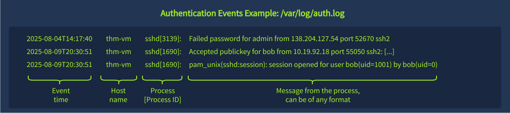
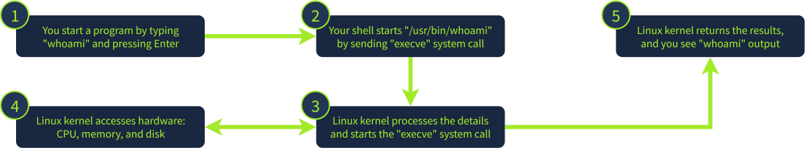
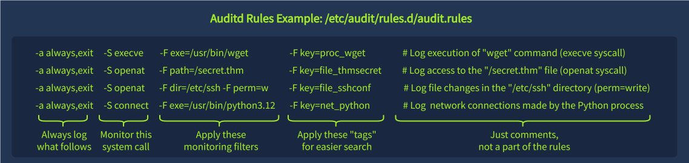

**Short Note: Linux Logging Basics**

Linux systems store logs as plain text files, mainly under `/var/log/`, which can be read with standard tools like `cat` or filtered using `grep`.

The main system log (`/var/log/syslog`) contains mixed system events such as service starts, cron jobs, and time synchronization messages.

Because logs can be large, filtering is essential. Common practice is using `grep` to isolate relevant events (e.g., `CRON`, `login`, `auth`, `session`).

Log files vary across distributions and can be customized in format, location, and verbosity.

---


**Short Note: Authentication Logs (/var/log/auth.log)**

`/var/log/auth.log` (or `/var/log/secure` on RHEL) records authentication and security-related events, including logins, sudo usage, and user management actions.

---

### Login & Session Activity

Tracks session start/stop for local login, SSH, cron, and SMB:

* `session opened` → user login or service start
* `session closed` → logout or session end
  Useful for monitoring both local and remote access.

---

### SSH Events

Logs SSH authentication attempts:

* `Accepted` → successful login
* `Failed password` → failed login attempt
  Includes username, IP address, and method (password/key).

---

### User Management

Tracks account changes:

* `useradd` → new user created
* `userdel` → user removed
* `usermod` → privilege/group changes
* `passwd` → password changes

---

### Sudo Activity

Records privileged command execution:

* Shows commands run with elevated rights via `sudo`
* Useful for detecting malicious or suspicious admin actions

---

### Summary

`auth.log` is critical for security monitoring: it centralizes authentication, privilege escalation, and user/account changes in one place.
---

**Short Note: Generic System Logs & App Logs**

### Generic System Logs (`/var/log`)

Linux stores many system events across different log files:

* `/var/log/kern.log` → Kernel messages and errors
* `/var/log/syslog` or `/var/log/messages` → General system activity
* `/var/log/dpkg.log` or `/var/log/apt` → Package installations (Debian)
* `/var/log/dnf.log` or `/var/log/yum.log` → Package installations (RHEL)

These logs are useful in **DFIR (Digital Forensics & Incident Response)** but are often too noisy for daily SOC monitoring.

---

### Application-Specific Logs

Applications maintain their own logs for monitoring and investigations.

Example: **Nginx access logs (`/var/log/nginx/access.log`)**
Track:

* Client IP
* Request method (GET/POST)
* Accessed URL
* Response status codes (200, 403, etc.)

Useful for detecting suspicious activity and user behavior.

---

### Bash History

Bash stores executed commands:

* File: `~/.bash_history`
* Command: `history`
* btw i used below code to find the flag:
`cat /root/.bash_history`
Useful for reviewing user actions, but limited because:

* Commands with a **leading space** may not be logged
* Commands run through **scripts** can bypass history
* Other shells (e.g. `/bin/sh`) may not save history
* Non-interactive actions (cron, services, web apps) are not tracked

**Key point:** Bash history is helpful but unreliable as a primary forensic source.
---

#*Short Note: Runtime Monitoring & System Calls**

### Runtime Monitoring

Default Linux logs do **not** track runtime events such as:

* Process creation
* File modifications/deletions
* Network activity

These events are important for answering questions like:

* *Which programs did a user run?*
* *Who deleted a file and when?*

To monitor them, Linux uses additional tools (similar to Sysmon on Windows), such as **auditd** and EDR solutions.

---

### System Calls

A **system call** is how a program requests services from the Linux kernel (e.g., open files, create processes, access hardware).

Example:

* `execve` → executes a program

Security tools monitor system calls because almost every action on Linux passes through them, making them a reliable source for logging and detection.

---
**Short Note: Auditd (Audit Daemon)**

* **Auditd** is a Linux runtime monitoring tool used to track **system calls** (processes, files, network activity).
* Rules are stored in **`/etc/audit/rules.d/`** and define **what to monitor**.
* Logs are stored in **`/var/log/audit/audit.log`**.
* Use **`ausearch -i`** to read and filter logs.

Example:

```bash
ausearch -i -k proc_wget
```

Searches events tagged with `proc_wget`.

Useful fields:

* `pid` → Process ID
* `ppid` → Parent Process ID
* `auid` → Original logged-in user
* `uid` → User who executed the action
* `exe` → Executed binary path
* `key` → Rule label for filtering

Auditd can monitor:

* **Process execution** (`execve`)
* **File changes** (`openat`)
* **Network activity**

Alternatives:

* **Sysmon for Linux**
* **Falco**
* **Osquery**
* **EDRs**

**Key idea:** Runtime monitoring tools mainly work by **monitoring system calls**.
---
### **Short Note: Finding Network Scans in Auditd**

To detect network scanning activity from auditd logs:

```bash id="q8k2nd"
ausearch -i | grep EXECVE
```

Then look for:

* `EXECVE` events showing executed commands
* suspicious tools (e.g. `nmap`, `naabu`, `masscan`)
* arguments like `-host`, `-p`, `-top-ports`

### Key example pattern:

```bash id="x3m8fa"
./naabu -host 192.168.50.0/24 -top-ports 100
```

👉 The network range scanned is the value after `-host` (or similar flag).

---

### **Key takeaway**

* `EXECVE` = command execution log
* Scan tools reveal target range in arguments
* Always inspect full command line (`a0`, `a1`, `a2`, …)

---

If you want, I can also give you a 1-line “exam shortcut” for this.

