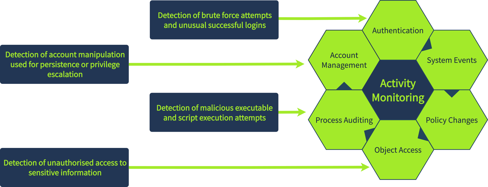
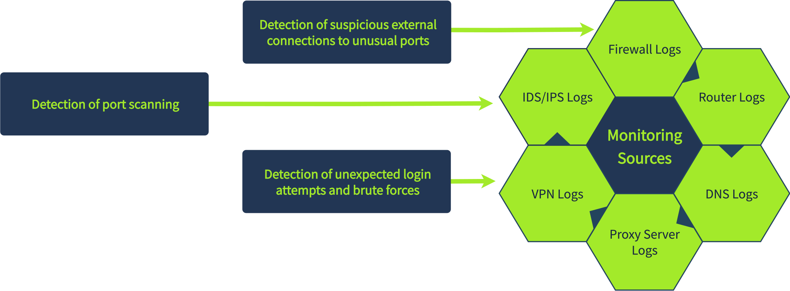
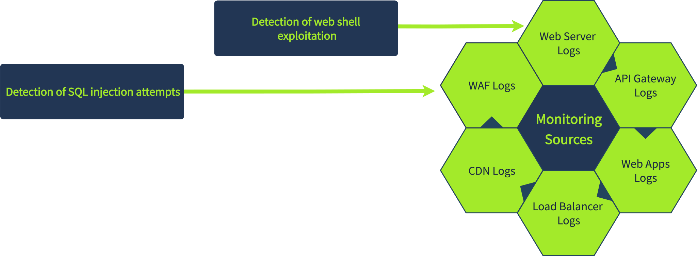

# SIEM Log Sources & Concepts
Collection → Parsing → Normalization → Enrichment → Storage → Correlation → Alerting

## 📡 Types of Log Sources

* **Host-Based:** Logs from individual workstations and servers. Used to monitor system-level behavior (e.g., malicious script execution, process creation).
* **Network-Based:** Logs from firewalls, routers, and IDS/IPS. Provides visibility into network traffic and inter-device communication.
* **Web-Based:** Logs from web applications. Essential for monitoring web-based attacks and vulnerabilities often used for initial access.

## ⏱️ Time Pitfalls

Logs arrive from devices across different time zones. The timestamp in the SIEM may be standardized (e.g., UTC) and differ from your local timezone. Always verify timezone settings to build accurate incident timelines.

## 🔄 Log Normalisation

Different systems send logs in entirely different formats (JSON, XML, plain text) and naming conventions. **Normalisation** is the process of converting all these disparate logs into a single, consistent structure within the SIEM, allowing analysts to search and correlate data efficiently.

---

### Knowledge Check Answers

* **What is the process of converting logs from different formats into a single format for easier analysis in a SIEM?**
`Normalisation`
* **Which log source type can be used to detect the execution of a malicious script?**
`Host-Based`
------------
---

