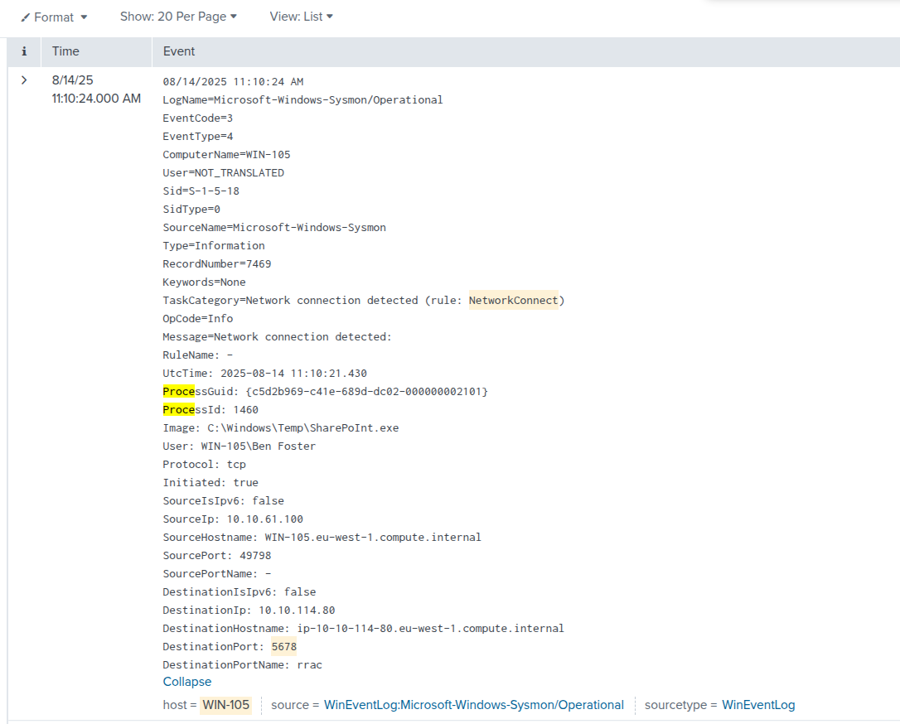
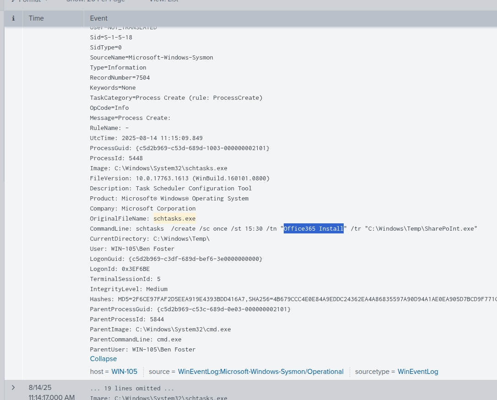
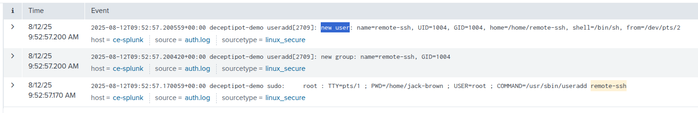
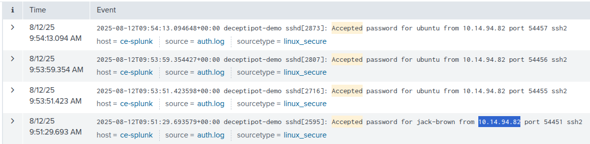
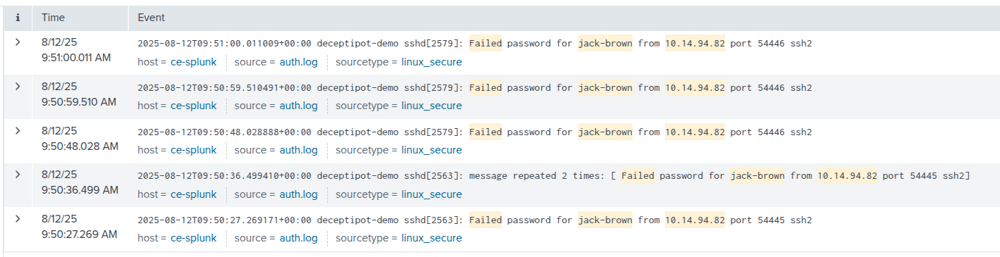
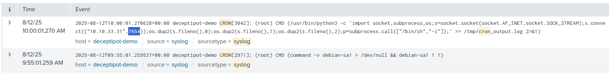

# SIEM Log Sources & Concepts
Collection → Parsing → Normalization → Enrichment → Storage → Correlation → Alerting

## 📡 Types of Log Sources

* **Host-Based:** Logs from individual workstations and servers. Used to monitor system-level behavior (e.g., malicious script execution, process creation).
* **Network-Based:** Logs from firewalls, routers, and IDS/IPS. Provides visibility into network traffic and inter-device communication.
* **Web-Based:** Logs from web applications. Essential for monitoring web-based attacks and vulnerabilities often used for initial access.


## ⏱️ Time Pitfalls

Logs arrive from devices across different time zones. The timestamp in the SIEM may be standardized (e.g., UTC) and differ from your local timezone. Always verify timezone settings to build accurate incident timelines.

## 🔄 Log Normalisation

Different systems send logs in entirely different formats (JSON, XML, plain text) and naming conventions. **Normalisation** is the process of converting all these disparate logs into a single, consistent structure within the SIEM, allowing analysts to search and correlate data efficiently.

---

### Knowledge Check Answers

* **What is the process of converting logs from different formats into a single format for easier analysis in a SIEM?**
`Normalisation`
* **Which log source type can be used to detect the execution of a malicious script?**
`Host-Based`
------------
### SIEM Windows Log Analysis — Short Notes

Windows monitoring mainly uses two sources:

**1. Sysmon** — installed and configured separately. It provides detailed visibility into:

* Process execution — **Event ID 1**
* Network connections — **Event ID 3**
* Process injection
* Registry changes
* File creation

Example: Detect encoded PowerShell execution:

```spl
index=winenv EventCode=1 *powershell* AND *EncodedCommand*
```

Example: Investigate network connections:

```spl
index=winenv EventCode=3 ComputerName=WINHOST05
```

**2. Windows Event Logs** — built into Windows and contain over 200 log channels.

**Security logs** monitor authentication, account changes, process execution, file access, policy changes, and log clearing.

* **4720:** User account created
* **4722:** User account enabled

**System logs** monitor operating-system services and errors. They are useful for detecting persistence and privilege escalation.

* **7045:** New service created
* **7036:** Service started or stopped

**Key point:** Combining Sysmon and Windows Event Logs gives analysts better visibility into process activity, network connections, account persistence, and malicious services.

##Scenario practice:
for finding the answer for below scenario i used below command in splunk:
`index=task4 host="WIN-105" 5678`

in the below you can see the result of siem command:

```
You are an SOC Level 1 Analyst on shift and have received an alert indicating a suspicious network connection using port 5678 on the WIN-105 host. Your task is to conduct an investigation and determine whether this activity is suspicious.
The logs for this task are located in the Splunk index task4. Use the following query: index=task4
```

for this question:
What is the MD5 hash of the malicious process from the previous question?
i used below command in splunk:
`index=task4 host="WIN-105" EventCode=1 Image="*\\SharePoInt.exe"`

What is the name of the scheduled task that was created on the system?
`index=task4 schtasks.exe` 
OR
`index=task4 *SharePoInt.exe* | table Time host User EventType Image CommandLine ParentCommandLine Message`

	
---
-----
### SIEM Linux Log Analysis — Short Notes

Linux monitoring mainly uses two log sources:

**1. `auth.log`** — records authentication and privilege activity:

* Successful and failed SSH logins
* `sudo` and `su` usage
* Brute-force attempts
* Possible privilege escalation

Detect SSH login attempts:

```spl
index=linux source="auth.log" *ubuntu* process=sshd
| search "Accepted password" OR "Failed password"
```

Many failed attempts followed by a successful login may indicate a **successful brute-force attack**.

Detect account switching or privilege escalation:

```spl
index=linux source="auth.log" *su*
| sort + _time
```

**2. `syslog`** — records general system activity:

* Service activity and restarts
* Cron jobs
* Background processes
* System events

Detect suspicious cron persistence:

```spl
index=linux sourcetype=syslog ("CRON" OR "cron")
| search ("python" OR "perl" OR "ruby" OR ".sh" OR "bash" OR "nc")
```

Example findings:

* A suspicious script in `/tmp` executed every five minutes
* A Perl reverse shell connecting to an external IP on port `9999`

**Additional Linux monitoring tools:** `auditd` and `osquery`.

**Practice scenario:** Investigate the creation of a suspicious `remote-ssh` user using:

```spl
index=task5
```

**Key point:** Combine `auth.log` and `syslog` to detect unauthorized access, privilege escalation, persistence, and suspicious system activity.
##Scenario Write-Up
####What was the timestamp of the remote-ssh account creation?
####Which user successfully escalated their privileges to root prior to the action from the first question?
`index=task5 "remote-ssh"`


####From which IP address did the user from the previous question successfully log in to the system?
`index=task5 "accepted"`


####How many failed login attempts occurred prior to this successful login? answer is 4
`index=task5 "failed" "jack-brown" "10.14.94.82"`


####Which port is the persistence mechanism configured to connect to?
`index=task5 sourcetype=syslog ("CRON" OR "cron")`

---

### SIEM Web Log Analysis — Short Notes

Web server logs mainly come from **Apache, Nginx, and other web servers**.

**Important log types:**

* **Access logs:** Requests, IP addresses, URLs, methods, status codes, and user agents
* **Error logs:** Server failures and application errors

They help detect **scanning, brute force, DDoS, web attacks, and web shells**.

### WordPress Brute Force

Look for many `POST` requests to `/wp-login.php` from the same IP.

```spl
index=* method=POST uri_path="/wp-login.php"
| bin _time span=5m
| stats values(status) as status values(useragent) as UserAgent count by clientip _time
| where count > 25
```

Indicators:

* High request count
* Same source IP
* Tools such as Hydra or WPScan
* Repeated login requests

### Possible Web Shell

Search for successful requests to suspicious executable files.

```spl
index=* status=200
| search uri_path IN (*.php, *.phtm, *.asp, *.aspx, *.jsp, *.exe)
  AND (method=POST OR method=GET)
| stats values(method) as method values(clientip) as clientip
  values(useragent) as UserAgent values(uri) as uri count by referer_domain
| where count > 2
```

Suspicious example: `505.php`

> The original query incorrectly used `method=POST AND method=GET`; it should use **OR**.

### DDoS Activity

Look for:

* `503 Service Unavailable`
* Very high request counts
* Large traffic spikes in a short period

```spl
index=* status=503
| bin _time span=10m
| stats values(useragent) as UserAgent values(uri_path) as uri_path count by clientip _time
| where count > 100000
```

### Practice Scenario Results

* **Target URI:** `/wp-login.php`
* **Source IP:** `10.10.243.134`
* **Classification:** Brute-force attack
* **Tool used:** WPScan

**Key point:** Use URI, HTTP method, status code, source IP, request count, and user-agent together to identify malicious web activity.
