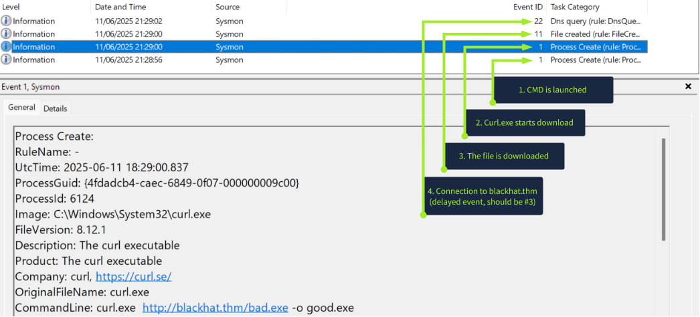

**Situational Awareness – Summary**

* After initial access, attackers perform **Discovery (MITRE ATT&CK)** to understand the system.

### Goal of Discovery

* Identify:

  * Files and purpose of host
  * Users and privileges
  * System apps and vulnerabilities
  * Network configuration
  * Security/AV tools

### Common Commands

* **Users:** `whoami`, `net user`, `net localgroup`
* **System:** `systeminfo`, `tasklist`, `wmic`
* **Files:** `dir`, `Get-ChildItem`
* **Network:** `ipconfig /all`, `netstat`
* **AV check:** PowerShell SecurityCenter query

### Attack Flow

1. Initial access (e.g., phishing)
2. Run discovery commands
3. Adapt attack (or self-delete if risk detected)
4. Establish control channel (remote access/C2)
5. Continue deeper system exploration manually

**Key idea:** Discovery = attacker mapping the environment before moving further in the attack chain.
-------
**Discovery Detection – Summary**

### Discovery via CMD

Attackers use built-in Windows commands to collect system information.

Common commands:

* `whoami` → user & privileges
* `ipconfig` → network info
* `dir` → files/folders
* `net user` → local users
* `tasklist` → running processes
* `wmic` → system details
* PowerShell (`Get-Service`, `Get-MpPreference`) → services & Defender

### Discovery via GUI

Interactive attackers (e.g., RDP) may use:

* Computer Management (`mmc`)
* Network settings (`control.exe`)
* Settings panel
* Notepad
* Task Manager

### Detection

* Check **Sysmon Event ID 1 (Process Creation)**
* Look for **multiple discovery commands in a short time**
* Build a **process tree** using:

  * `ProcessId`
  * `ParentProcessId`

### Typical Attack Chain

```text
explorer.exe
   ↓
malware.exe
   ↓
cmd.exe / powershell.exe
   ↓
Discovery commands
```
--------
**Collection & Exfiltration – Summary**

After discovery, attackers **collect valuable data** and **send it outside the system**.

### Main Goals

* **Blackmail** → photos, chats, browser history
* **Steal money** → banking sessions, crypto wallets
* **Steal corporate data** → SSH keys, databases

### Common Targets

* Browser data (history, cookies)
* Messaging apps
* Crypto wallets
* SSH credentials
* Database files
* Registry / process memory

### Exfiltration (Data Theft)

Attackers upload stolen data to:

* Cloud storage (Dropbox, Mega, S3)
* Code platforms (GitHub)
* Messaging apps (Telegram)
* Fake legitimate-looking domains

### Attack Flow

```text id="rk04ku"
Initial Access
↓
Discovery
↓
Collection
↓
Archive Data
↓
Exfiltration
```
---------------------
**Detecting Collection – Summary**

Attackers search, copy, and archive valuable data before exfiltration.

### Detection Indicators

* Opening sensitive files:

  * `notepad.exe <file>`
* Searching for secrets:

  * `type file | findstr password`
  * `Get-ChildItem -Recurse`
* Copying data:

  * `copy <source> <destination>`
* Archiving stolen files:

  * `Compress-Archive`
  * `7za.exe`

### Monitoring

* Check **Sysmon Event ID 1 (Process Creation)**
* Look for:

  * File access
  * Bulk file searches
  * Copies to Temp folders
  * ZIP/archive creation

### Collection Types

* **Manual Collection** → attacker opens files (Notepad, Wordpad, 7-Zip)
* **Data Stealers** → malware automatically collects:

  * Browser sessions
  * VPN profiles
  * Crypto wallets
  * Messaging apps
  * Screenshots

### Typical Flow

```text
Discovery
↓
Search Files
↓
Copy Data
↓
Archive
↓
Exfiltration
```
---------------
**Ingress Tool Transfer – Summary**

Attackers often **download extra tools after initial access** to expand capabilities.

### Common Downloaded Tools

* Discovery tools (e.g. vulnerability enumeration)
* Credential dumping tools
* Remote Access Trojans (RATs)
* Ransomware payloads

### Common Transfer Methods

* **Certutil**

  ```text
  certutil -urlcache -f <url> <file>
  ```
* **Curl**

  ```text
  curl <url> -o <file>
  ```
* **PowerShell**

  ```text
  Invoke-WebRequest
  ```
* **GUI**

  * Browser download
  * Copy/paste over RDP

### Why Attackers Split Payloads

* Evade antivirus
* Reduce exposure if caught early

### Detection

* Monitor **network connections / DNS**
* Check:

  * Process making connection
  * Destination domain
  * Downloaded file
* Build process chain using **Sysmon**

### Typical Flow

```text id="v3pqkn"
Initial Access
↓
Download Tool
↓
Save File
↓
Execute Tool
```

